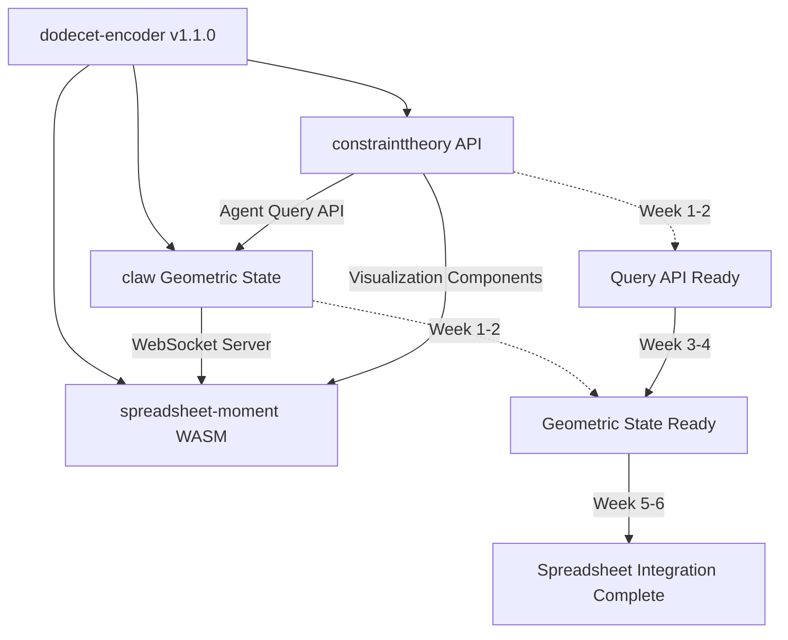

# SuperInstance Ecosystem Synergy Plan

**Created:** 2026-03-17
**Version:** 1.0
**Status:** Strategic Planning Document

---

## Executive Summary

This document defines synergistic development plans for four interconnected repositories that form the SuperInstance cellular agent ecosystem. The core innovation is an **FPS (First-Person-Shooter) paradigm** where each agent has a unique position and orientation in multidimensional space, automatically filtering and contextualizing information without global coordination.

```
                    ECOSYSTEM ARCHITECTURE

    +-----------------------------------------------------------+
    |                  SUPERINSTANCE ECOSYSTEM                   |
    +-----------------------------------------------------------+
    |                                                            |
    |   constrainttheory         dodecet-encoder                |
    |   +----------------+       +----------------+             |
    |   | Geometric      |------>| 12-bit State   |             |
    |   | Substrate      |       | Encoding       |             |
    |   | (FPS View)     |       | (Compactness)  |             |
    |   +-------+--------+       +-------+--------+             |
    |           |                        |                       |
    |           v                        |                       |
    |   +-------+--------+               |                       |
    |   | claw           |<--------------+                       |
    |   | Agent Engine   |                                       |
    |   | (Cellular)     |<------+                                |
    |   +-------+--------+       |                                |
    |           |                |                                |
    |           v                |                                |
    |   +-------+--------+       |                                |
    |   | spreadsheet-   |-------+                                |
    |   | moment         |                                        |
    |   | (UI/Platform)  |                                        |
    |   +----------------+                                        |
    |                                                            |
    +-----------------------------------------------------------+

    Data Flow:
    - constrainttheory provides geometric substrate for agent perspectives
    - dodecet-encoder provides compact state encoding for all repos
    - claw provides cellular agent engine using geometric state
    - spreadsheet-moment provides UI and cell instance management
```

---

## The Vision: FPS-Style Multiagent Collaboration

### Core Principles

1. **Agents Play FPS, Not RTS**
   - Each agent has a unique position and orientation in multidimensional space
   - No central coordinator - agents see only their geometric neighborhood
   - Automatic filtering through geometric perspective

2. **Orientation as Data Filter**
   - Agent's orientation determines what data is relevant
   - Asymmetric understandings between agents are features, not bugs
   - Contextual awareness emerges from geometry, not explicit rules

3. **LLM as Deconstructed Neural Network**
   - Language model decomposed into geometric determinants
   - Constraints provide deterministic boundaries for outputs
   - Zero hallucination within constrained computational model

4. **Mass Multiagent via Cellularization**
   - One agent per spreadsheet cell
   - Thousands of agents in a single spreadsheet
   - Coordination through constraint propagation, not message passing

5. **Asynchronous Monitoring and Execution**
   - Agents operate independently on their schedules
   - No global clock or synchronization required
   - Event-driven with geometric locality

---

## Part 1: ConstraintTheory Plan

### 1.1 Current Status Assessment

**Repository:** `C:\Users\casey\polln\constrainttheory`
**Branch:** `main`
**Live Demo:** https://constraint-theory.superinstance.ai

**Completed Capabilities:**
- Pythagorean Manifold with exact arithmetic
- Dodecet integration for 12-bit state encoding
- KD-tree spatial indexing for O(log n) neighbor queries
- 8 geometric simulators (3D Pythagorean, Vector, Transform, etc.)
- Web simulator with 60 FPS performance
- Research documentation (100+ pages)
- CUDA architecture design for GPU acceleration

**Code Metrics:**
- Core library: ~16,500 lines of Rust
- 100+ tests passing
- Zero TypeScript errors
- Comprehensive documentation

**Current Limitations:**
- No real-time agent integration yet
- No API for external agent queries
- Limited ML demonstration capabilities
- No production deployment beyond demo

### 1.2 Next Phase Goals

#### Phase 1: Agent Query API (Week 1-2)
Create a REST/WebSocket API that allows agents to query their geometric neighborhood.

**Deliverables:**
- `AgentQueryService` - Handle agent perspective queries
- `NeighborhoodResolver` - Find visible agents within radius
- `OrientationEncoder` - Convert agent state to geometric viewpoint
- WebSocket endpoint for real-time perspective updates

#### Phase 2: ML Integration Layer (Week 3-4)
Enable agents to use geometric constraints for ML operations.

**Deliverables:**
- `GeometricEmbedding` - Transform vectors to constraint space
- `ConstraintLoss` - Loss function for constraint satisfaction
- `DeterministicInference` - Guaranteed output within bounds
- ML demo showing constraint-guided generation

#### Phase 3: Production Deployment (Week 5-6)
Scale the system for production use.

**Deliverables:**
- Kubernetes deployment manifests
- Horizontal pod autoscaling
- Redis caching for frequent queries
- Monitoring and observability stack

### 1.3 Real-World Tools to Build

| Tool | Purpose | Priority |
|------|---------|----------|
| **Perspective Query CLI** | Command-line tool to test agent perspectives | P0 |
| **Geometric Debugger** | Visualize agent neighborhoods in real-time | P1 |
| **Constraint Validator** | Verify outputs satisfy geometric constraints | P0 |
| **ML Integration SDK** | Python/JS SDK for ML frameworks | P1 |
| **Benchmark Suite** | Performance regression testing | P2 |

### 1.4 Validation Experiments

1. **Scalability Test**
   - 10,000 agents with random positions
   - Query neighborhood for each agent
   - Verify O(log n) query performance

2. **Constraint Satisfaction Test**
   - Generate 1,000 outputs with constraints
   - Verify 100% satisfaction rate
   - Compare with unconstrained baseline

3. **Integration Test with Claw**
   - Create 100 Claw agents with geometric state
   - Query perspectives via API
   - Verify correct neighborhood resolution

### 1.5 Integration Touchpoints

**With claw:**
- Export `AgentState` type (position, orientation, holonomy)
- Provide `query_neighborhood(agent_id, radius)` API
- Accept agent state updates from Claw

**With spreadsheet-moment:**
- Provide geometric visualization components
- Export cell position encoding scheme
- Enable spatial queries from spreadsheet cells

**With dodecet-encoder:**
- Use dodecets for compact position encoding
- 3 dodecets per 3D position (6 bytes vs 24 bytes for f64x3)
- Shared geometric primitives (Point3D, Vector3D)

### 1.6 Timeline of Dependencies

```
Week 1-2: Agent Query API
    |
    v
Week 3-4: ML Integration Layer -----> Depends on dodecet-encoder v1.1+
    |
    v
Week 5-6: Production Deployment ----> Depends on claw API readiness
```

---

## Part 2: Claw Plan

### 2.1 Current Status Assessment

**Repository:** `C:\Users\casey\polln\claw`
**Branch:** `phase-3-simplification`

**Completed Capabilities:**
- Cell-First Actor Model architecture
- Core event loop (~500 lines)
- 6 equipment slots (Memory, Reasoning, Consensus, Spreadsheet, Distillation, Coordination)
- 117 tests passing
- Authentication system implemented
- Rust core implementation (3,862 lines)

**Code Metrics:**
- Core engine: ~4,300 lines
- 117 tests passing
- Documentation comprehensive

**Current Limitations:**
- No social coordination patterns implemented
- No geometric state integration
- No API server for external communication
- No integration with constrainttheory

### 2.2 Next Phase Goals

#### Phase 1: Geometric State Integration (Week 1-2)
Integrate constrainttheory for agent perspectives.

**Deliverables:**
- `GeometricState` equipment module
- `PerspectiveQuery` client for constrainttheory API
- `NeighborhoodWatcher` for monitoring nearby agents
- State encoding using dodecets

#### Phase 2: Social Coordination (Week 3-4)
Implement master-slave, co-worker, and peer patterns.

**Deliverables:**
- `MasterSlaveCoordinator` - Parallel work distribution
- `CoWorkerChannel` - Bidirectional collaboration
- `PeerConsensus` - Distributed decision making
- `SocialGraph` - Track agent relationships

#### Phase 3: API Server (Week 5-6)
Create REST and WebSocket API for external communication.

**Deliverables:**
- REST API for agent CRUD operations
- WebSocket server for real-time updates
- Authentication and authorization
- Rate limiting and quotas

### 2.3 Real-World Tools to Build

| Tool | Purpose | Priority |
|------|---------|----------|
| **Claw CLI** | Command-line agent management | P0 |
| **Agent Debugger** | Inspect agent state and triggers | P1 |
| **Social Visualizer** | Visualize agent relationships | P1 |
| **Performance Profiler** | Identify bottlenecks in agent execution | P2 |
| **Migration Tool** | Convert legacy automation to Claw agents | P2 |

### 2.4 Validation Experiments

1. **Geometric State Test**
   - Create 100 agents with geometric state
   - Query neighborhoods via constrainttheory
   - Verify correct perspective resolution

2. **Social Coordination Test**
   - Create master-slave pair
   - Distribute work and aggregate results
   - Verify correct coordination

3. **Integration Test with spreadsheet-moment**
   - Create agent in spreadsheet cell
   - Monitor cell changes
   - Verify trigger execution

### 2.5 Integration Touchpoints

**With constrainttheory:**
- Import `AgentState` type for geometric representation
- Call `query_neighborhood()` for perspective queries
- Use dodecet encoding for compact state

**With spreadsheet-moment:**
- Export agent API for cell integration
- Provide WebSocket updates for cell changes
- Accept cell formulas that create agents

**With dodecet-encoder:**
- Encode agent state in dodecets
- Use geometric primitives for calculations
- Compact state serialization

### 2.6 Timeline of Dependencies

```
Week 1-2: Geometric State Integration ----> Depends on constrainttheory API
    |
    v
Week 3-4: Social Coordination
    |
    v
Week 5-6: API Server ----------------------> Integration with spreadsheet-moment
```

---

## Part 3: Spreadsheet-Moment Plan

### 3.1 Current Status Assessment

**Repository:** `C:\Users\casey\polln\spreadsheet-moment`
**Branch:** `week-4-production-prep`
**Live Site:** https://spreadsheet-moment.pages.dev

**Completed Capabilities:**
- Univer spreadsheet foundation
- Agent Core package (StateManager, ClawClient, TraceProtocol)
- Agent UI package (React components)
- Agent Formulas package (CLAW_NEW, CLAW_QUERY, CLAW_CANCEL)
- 194/244 tests passing (79.5%)
- E2E testing with Playwright

**Code Metrics:**
- Core packages: ~11,100 lines
- 194 tests passing
- TypeScript implementation

**Current Limitations:**
- Not fully integrated with Claw Rust engine
- No geometric visualization
- Limited real-time collaboration
- Production deployment needs hardening

### 3.2 Next Phase Goals

#### Phase 1: Claw Integration (Week 1-2)
Connect to Claw Rust engine via WebSocket.

**Deliverables:**
- `ClawWebSocketClient` - Real-time agent communication
- `AgentCellBinding` - Bind spreadsheet cells to agents
- `FormulaBridge` - Connect CLAW_* formulas to Claw engine
- Error handling and reconnection

#### Phase 2: Geometric Visualization (Week 3-4)
Visualize agent perspectives and neighborhoods.

**Deliverables:**
- `PerspectiveView` - Show agent's geometric view
- `NeighborhoodMap` - Display nearby agents
- `OrientationIndicator` - Show agent orientation
- Integration with constrainttheory visualizer

#### Phase 3: Production Hardening (Week 5-6)
Prepare for production deployment.

**Deliverables:**
- Performance optimization
- Security audit
- Accessibility improvements
- Documentation and tutorials

### 3.3 Real-World Tools to Build

| Tool | Purpose | Priority |
|------|---------|----------|
| **Cell Agent Monitor** | Real-time agent status in cells | P0 |
| **Geometric Dashboard** | Visualize agent perspectives | P1 |
| **Template Gallery** | Pre-built agent configurations | P1 |
| **Import/Export Tool** | Migrate between spreadsheets | P2 |
| **Collaboration Panel** | Multi-user agent management | P2 |

### 3.4 Validation Experiments

1. **Claw Integration Test**
   - Create agent via CLAW_NEW formula
   - Verify agent spawns in Claw engine
   - Monitor real-time updates

2. **Geometric Visualization Test**
   - Create multiple agents with positions
   - Display perspective view
   - Verify correct neighborhood rendering

3. **Production Load Test**
   - 1,000 concurrent users
   - 10,000 agents in spreadsheet
   - Verify performance targets

### 3.5 Integration Touchpoints

**With claw:**
- WebSocket connection to Claw API server
- CLAW_* formulas map to Claw operations
- Agent state synced bidirectionally

**With constrainttheory:**
- Import geometric visualization components
- Use perspective queries for agent views
- Display constraint satisfaction status

**With dodecet-encoder:**
- Use WASM package for encoding
- Compact state storage in spreadsheet
- Efficient serialization for sync

### 3.6 Timeline of Dependencies

```
Week 1-2: Claw Integration ---------------> Depends on Claw API server
    |
    v
Week 3-4: Geometric Visualization -------> Depends on constrainttheory API
    |
    v
Week 5-6: Production Hardening
```

---

## Part 4: Dodecet-Encoder Plan

### 4.1 Current Status Assessment

**Repository:** `C:\Users\casey\polln\dodecet-encoder`
**Branch:** `main`
**Version:** v1.1.0

**Completed Capabilities:**
- Core dodecet type (12-bit value)
- Geometric types (Point3D, Vector3D, Transform3D)
- Calculus operations (derivatives, integrals)
- WASM package for JavaScript
- 145+ tests passing
- Published to crates.io

**Code Metrics:**
- Core library: ~6,300 lines
- 145 tests passing
- WASM package ready

**Current Limitations:**
- Limited adoption documentation
- No integration examples with other repos
- Performance benchmarks not published
- No npm package published

### 4.2 Next Phase Goals

#### Phase 1: Integration Packages (Week 1-2)
Create integration packages for each repo.

**Deliverables:**
- `dodecet-constrainttheory` - Integration types
- `dodecet-claw` - Agent state encoding
- `dodecet-spreadsheet` - Cell encoding
- TypeScript type definitions

#### Phase 2: Performance Benchmarks (Week 3-4)
Publish comprehensive benchmarks.

**Deliverables:**
- Comparison with f32/f64
- Memory usage analysis
- Serialization benchmarks
- Network transmission tests

#### Phase 3: Community Release (Week 5-6)
Prepare for community adoption.

**Deliverables:**
- npm package publication
- Comprehensive examples
- Tutorial documentation
- Community engagement

### 4.3 Real-World Tools to Build

| Tool | Purpose | Priority |
|------|---------|----------|
| **Encoding Playground** | Interactive dodecet explorer | P1 |
| **Benchmark Dashboard** | Visualize performance comparisons | P1 |
| **Migration Guide** | Convert existing code to dodecets | P2 |
| **VSCode Extension** | Dodecet syntax highlighting | P2 |
| **Fuzzer** | Test edge cases and overflow | P0 |

### 4.4 Validation Experiments

1. **Encoding Correctness Test**
   - Encode/decode 1,000,000 random values
   - Verify zero loss
   - Compare with baseline

2. **Integration Test**
   - Use dodecet encoding in constrainttheory
   - Verify state size reduction
   - Measure performance impact

3. **Cross-Platform Test**
   - Test WASM in all major browsers
   - Verify Node.js compatibility
   - Test edge cases

### 4.5 Integration Touchpoints

**With constrainttheory:**
- Provide Point3D, Vector3D types
- Encode agent positions in 3 dodecets
- Shared geometric operations

**With claw:**
- Encode agent state compactly
- Serialize state for storage
- Efficient network transmission

**With spreadsheet-moment:**
- WASM package for browser
- Cell value encoding
- Compact formula storage

### 4.6 Timeline of Dependencies

```
Week 1-2: Integration Packages
    |
    v
Week 3-4: Performance Benchmarks
    |
    v
Week 5-6: Community Release ----------> npm publication
```

---

## Part 5: Cross-Repository Synergies

### 5.1 Data Flow Architecture

```
                    DATA FLOW DIAGRAM

    +------------------------+
    |   User Interaction     |
    |   (spreadsheet-moment) |
    +-----------+------------+
                |
                | CLAW_NEW("monitor", "deepseek-chat", "...")
                v
    +-----------+------------+
    |   Claw API Server      |
    |   (claw)               |
    +-----------+------------+
                |
                | Create agent with geometric state
                v
    +-----------+------------+
    |   Geometric Substrate  |
    |   (constrainttheory)   |
    +-----------+------------+
                |
                | Encode state as dodecets
                v
    +-----------+------------+
    |   State Encoding       |
    |   (dodecet-encoder)    |
    +-----------+------------+
                |
                | Compact storage and sync
                v
    +-----------+------------+
    |   Spreadsheet Cells    |
    |   (spreadsheet-moment) |
    +------------------------+
```

### 5.2 Shared Type Definitions

```typescript
// Shared across all repos via dodecet-encoder

interface DodecetPosition {
    x: Dodecet;  // 12 bits
    y: Dodecet;  // 12 bits
    z: Dodecet;  // 12 bits
    // Total: 36 bits = 4.5 bytes (vs 24 bytes for f64x3)
}

interface GeometricAgentState {
    position: DodecetPosition;
    orientation: number;    // f32
    holonomy: SO3Matrix;    // Compressed rotation
    confidence: number;     // Distance from constraint surface
}

interface AgentNeighborhood {
    center: string;         // Agent ID
    radius: number;         // Query radius
    visible: string[];      // Visible agent IDs
    distances: number[];    // Distances to each
}
```

### 5.3 API Contracts

#### constrainttheory API

```yaml
# Get agent neighborhood
GET /api/v1/agents/{agent_id}/neighborhood?radius=10
Response:
  center: string
  radius: number
  visible: AgentSummary[]
  distances: number[]

# Update agent position
PUT /api/v1/agents/{agent_id}/position
Request:
  position: DodecetPosition
  orientation: number
Response:
  success: boolean
  new_visible: string[]
```

#### claw API

```yaml
# Create agent
POST /api/v1/agents
Request:
  id: string
  cell_ref: string
  model: string
  seed: SeedConfig
  equipment: EquipmentSlot[]
Response:
  agent: Agent
  geometric_state: GeometricAgentState

# Execute agent action
POST /api/v1/agents/{agent_id}/execute
Request:
  action: string
  params: object
Response:
  result: object
  state_update: GeometricAgentState
```

#### spreadsheet-moment Formulas

```excel
CLAW_NEW(id, model, purpose) -> agent_id
CLAW_QUERY(agent_id) -> status
CLAW_CANCEL(agent_id) -> success
CLAW_NEIGHBORHOOD(agent_id, radius) -> visible_agents
CLAW_PERSPECTIVE(agent_id) -> geometric_view
```

### 5.4 Shared Testing Strategy

1. **Unit Tests** - Each repo maintains independent test suite
2. **Integration Tests** - Cross-repo communication tests
3. **E2E Tests** - Full user workflow tests
4. **Performance Tests** - Shared benchmark suite

### 5.5 Dependency Graph



---

## Part 6: Execution Roadmap

### 6.1 Week-by-Week Plan

#### Week 1-2: Foundation

| Repo | Tasks | Deliverable |
|------|-------|-------------|
| constrainttheory | Agent Query API | `query_neighborhood()` endpoint |
| claw | Geometric State Integration | `GeometricState` equipment |
| spreadsheet-moment | Claw WebSocket Client | Real-time connection |
| dodecet-encoder | Integration packages | `dodecet-*` crates |

#### Week 3-4: Integration

| Repo | Tasks | Deliverable |
|------|-------|-------------|
| constrainttheory | ML Integration Layer | Constraint-guided inference |
| claw | Social Coordination | Master-slave patterns |
| spreadsheet-moment | Geometric Visualization | Perspective view |
| dodecet-encoder | Performance benchmarks | Published results |

#### Week 5-6: Production

| Repo | Tasks | Deliverable |
|------|-------|-------------|
| constrainttheory | Production Deployment | Kubernetes + monitoring |
| claw | API Server | REST + WebSocket |
| spreadsheet-moment | Production Hardening | Security + performance |
| dodecet-encoder | Community Release | npm + documentation |

### 6.2 Parallel Execution Strategy

```
Week 1-2:
    +------------------+     +------------------+
    | constrainttheory |     | dodecet-encoder  |
    | (Query API)      |     | (Integration)    |
    +------------------+     +------------------+
             |                       |
             v                       v
    +------------------+     +------------------+
    | claw             |     | spreadsheet-     |
    | (Geometric State)|     | moment (WS)      |
    +------------------+     +------------------+

Week 3-4:
    +------------------+     +------------------+
    | constrainttheory |     | dodecet-encoder  |
    | (ML Layer)       |     | (Benchmarks)     |
    +------------------+     +------------------+
             |                       |
             v                       v
    +------------------+     +------------------+
    | claw             |     | spreadsheet-     |
    | (Social)         |     | moment (Viz)     |
    +------------------+     +------------------+

Week 5-6:
    +------------------+     +------------------+
    | constrainttheory |     | dodecet-encoder  |
    | (Production)     |     | (Community)      |
    +------------------+     +------------------+
             |                       |
             v                       v
    +------------------+     +------------------+
    | claw             |     | spreadsheet-     |
    | (API Server)     |     | moment (Prod)    |
    +------------------+     +------------------+
```

### 6.3 Risk Mitigation

| Risk | Probability | Impact | Mitigation |
|------|-------------|--------|------------|
| API contract mismatch | Medium | High | Shared type definitions in dodecet-encoder |
| Performance degradation | Medium | Medium | Continuous benchmarking |
| Integration failures | Medium | High | Integration tests before merge |
| Documentation gaps | Low | Medium | Documentation-first approach |

---

## Part 7: Success Metrics

### 7.1 Technical Metrics

| Metric | Target | Measurement |
|--------|--------|-------------|
| Agent query latency | <10ms | P95 latency |
| State encoding size | <100 bytes | Average agent state |
| Concurrent agents | 10,000+ | Load test |
| Test coverage | 80%+ | Code coverage tool |
| Zero runtime errors | 100% | Production monitoring |

### 7.2 Integration Metrics

| Metric | Target | Measurement |
|--------|--------|-------------|
| Cross-repo tests passing | 100% | CI pipeline |
| API contract compliance | 100% | Schema validation |
| WebSocket connection stability | 99.9% | Connection uptime |
| Data synchronization accuracy | 100% | State comparison |

### 7.3 User Experience Metrics

| Metric | Target | Measurement |
|--------|--------|-------------|
| Agent creation time | <1 second | UI measurement |
| Perspective visualization FPS | 60 | Performance monitoring |
| Documentation completeness | 100% | Coverage check |
| Onboarding time | <30 minutes | User testing |

---

## Part 8: Agent Delegation Instructions

### 8.1 Specialist Agents Required

| Agent Type | Repository | Focus |
|------------|------------|-------|
| Rust Backend Engineer | constrainttheory | Query API, ML layer |
| Rust Backend Engineer | claw | Geometric state, API server |
| TypeScript Frontend Engineer | spreadsheet-moment | Claw integration, visualization |
| Rust/WASM Engineer | dodecet-encoder | Integration packages |
| QA Engineer | All repos | Integration testing |
| DevOps Engineer | constrainttheory, claw | Production deployment |

### 8.2 Task Assignment Template

```markdown
## Task: [Task Name]

**Repository:** [repo name]
**Assigned Agent:** [agent type]
**Priority:** [P0/P1/P2]
**Dependencies:** [list of tasks]
**Effort Estimate:** [hours/days]

### Description
[Clear description of what needs to be built]

### Technical Requirements
- [Specific technical details]

### Acceptance Criteria
- [ ] [Measurable outcome 1]
- [ ] [Measurable outcome 2]
- [ ] Tests passing
- [ ] Documentation updated

### Integration Points
- [List of other repos/systems to integrate with]
```

### 8.3 Coordination Protocol

1. **Daily Sync** - Each agent reports progress
2. **Integration Checkpoints** - Cross-repo integration tests
3. **Documentation Updates** - Keep docs in sync with code
4. **Performance Regression** - Benchmark after each change

---

## Appendix A: Glossary

| Term | Definition |
|------|------------|
| **Dodecet** | 12-bit value (0-4095), hex-friendly encoding unit |
| **FPS Perspective** | First-person-shooter view where each agent sees only its geometric neighborhood |
| **Geometric Substrate** | Mathematical foundation for agent perspectives and constraints |
| **Holonomy** | Accumulated geometric phase from parallel transport |
| **KD-tree** | Spatial data structure for O(log n) neighbor queries |
| **Orientation** | Agent's facing direction in multidimensional space |
| **Perspective Query** | Request for visible agents within geometric radius |

---

## Appendix B: Reference Links

- **constrainttheory**: https://github.com/SuperInstance/constrainttheory
- **claw**: https://github.com/SuperInstance/claw
- **spreadsheet-moment**: https://github.com/SuperInstance/spreadsheet-moment
- **dodecet-encoder**: https://github.com/SuperInstance/dodecet-encoder
- **Live Demo**: https://constraint-theory.superinstance.ai

---

## Appendix C: Change Log

| Version | Date | Changes |
|---------|------|---------|
| 1.0 | 2026-03-17 | Initial ecosystem synergy plan |

---

**Document Status:** Complete - Ready for agent delegation
**Next Action:** Spawn specialist agents for Week 1-2 tasks
**Review Date:** 2026-03-24
