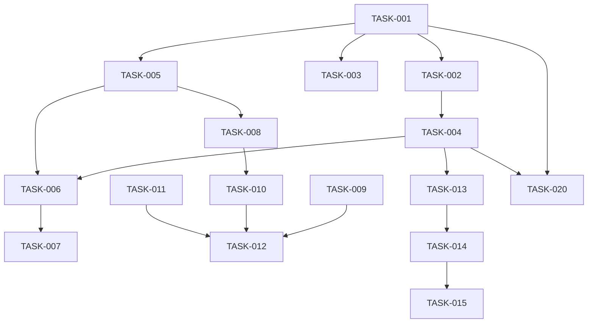

# SuperInstance Ecosystem Task Assignments

**Generated:** 2026-03-17
**Source Document:** ECOSYSTEM_SYNERGY_PLAN.md
**Execution Phase:** Week 1-2 (Foundation)

---

## Task Assignment Overview

This document provides task assignments for specialist agents executing the Ecosystem Synergy Plan. Tasks are organized by repository and include dependencies, effort estimates, and status tracking.

---

## Task Assignment Table

| Task ID | Description | Type | Assigned Sub-Agent | Dependencies | Effort | Status |
|---------|-------------|------|-------------------|--------------|--------|--------|
| TASK-001 | Agent Query API Service | Backend (Rust) | Rust Backend Engineer | None | 16h | To Do |
| TASK-002 | NeighborhoodResolver Implementation | Backend (Rust) | Rust Backend Engineer | TASK-001 | 8h | To Do |
| TASK-003 | OrientationEncoder Module | Backend (Rust) | Rust Backend Engineer | TASK-001 | 8h | To Do |
| TASK-004 | WebSocket Endpoint for Perspectives | Backend (Rust) | Rust Backend Engineer | TASK-002 | 12h | To Do |
| TASK-005 | GeometricState Equipment Module | Backend (Rust) | Rust Backend Engineer | TASK-001 | 12h | To Do |
| TASK-006 | PerspectiveQuery Client | Backend (Rust) | Rust Backend Engineer | TASK-004, TASK-005 | 8h | To Do |
| TASK-007 | NeighborhoodWatcher Service | Backend (Rust) | Rust Backend Engineer | TASK-006 | 8h | To Do |
| TASK-008 | Dodecet State Encoding | Backend (Rust) | Rust Backend Engineer | TASK-005 | 6h | To Do |
| TASK-009 | dodecet-constrainttheory Package | Library (Rust) | Rust/WASM Engineer | None | 8h | To Do |
| TASK-010 | dodecet-claw Package | Library (Rust) | Rust/WASM Engineer | TASK-008 | 8h | To Do |
| TASK-011 | dodecet-spreadsheet Package | Library (Rust/WASM) | Rust/WASM Engineer | None | 8h | To Do |
| TASK-012 | TypeScript Type Definitions | Frontend (TS) | TS Frontend Engineer | TASK-009, TASK-010, TASK-011 | 6h | To Do |
| TASK-013 | Claw WebSocket Client | Frontend (TS) | TS Frontend Engineer | TASK-004 | 12h | To Do |
| TASK-014 | AgentCellBinding Component | Frontend (TS) | TS Frontend Engineer | TASK-013 | 10h | To Do |
| TASK-015 | FormulaBridge Implementation | Frontend (TS) | TS Frontend Engineer | TASK-014 | 8h | To Do |
| TASK-016 | Integration Test Suite | Testing (Mixed) | QA Engineer | TASK-001 through TASK-015 | 16h | To Do |
| TASK-017 | Cross-Repo Communication Tests | Testing (Mixed) | QA Engineer | TASK-016 | 8h | To Do |
| TASK-018 | Performance Benchmark Suite | Testing (Mixed) | QA Engineer | TASK-016 | 8h | To Do |
| TASK-019 | Documentation Update | Documentation | Technical Writer | TASK-001 through TASK-015 | 8h | To Do |
| TASK-020 | API Contract Validation | DevOps | DevOps Engineer | TASK-001, TASK-004 | 6h | To Do |

---

## Detailed Task Specifications

### TASK-001: Agent Query API Service

**Repository:** constrainttheory
**Assigned to:** Rust Backend Engineer
**Effort:** 16 hours
**Dependencies:** None
**Status:** To Do

**Description:**
Create a REST API service that allows agents to query their geometric neighborhood. This is the foundation for FPS-style perspective queries.

**Technical Requirements:**
- Axum or Actix-web framework
- `/api/v1/agents/{agent_id}/neighborhood` endpoint
- Query parameters: `radius`, `include_distances`
- Response: JSON with visible agents and distances

**Acceptance Criteria:**
- [ ] API endpoint responds to GET requests
- [ ] Returns list of visible agent IDs
- [ ] Includes distances when requested
- [ ] Handles missing agents with 404
- [ ] Unit tests passing
- [ ] API documentation complete

**Files to Create:**
- `constrainttheory/crates/api/src/query.rs`
- `constrainttheory/crates/api/src/neighborhood.rs`
- `constrainttheory/crates/api/src/handlers.rs`
- `constrainttheory/tests/api_test.rs`

---

### TASK-002: NeighborhoodResolver Implementation

**Repository:** constrainttheory
**Assigned to:** Rust Backend Engineer
**Effort:** 8 hours
**Dependencies:** TASK-001
**Status:** To Do

**Description:**
Implement the core neighborhood resolution logic using KD-tree spatial queries.

**Technical Requirements:**
- Use existing KD-tree implementation
- Support configurable radius
- Return sorted by distance
- O(log n) query performance

**Acceptance Criteria:**
- [ ] Correctly finds all agents within radius
- [ ] Returns results sorted by distance
- [ ] Performance: <10ms for 10,000 agents
- [ ] Unit tests passing

**Files to Create:**
- `constrainttheory/crates/constraint-theory-core/src/neighborhood.rs`

---

### TASK-003: OrientationEncoder Module

**Repository:** constrainttheory
**Assigned to:** Rust Backend Engineer
**Effort:** 8 hours
**Dependencies:** TASK-001
**Status:** To Do

**Description:**
Create module to convert agent state to geometric viewpoint encoding.

**Technical Requirements:**
- Convert (position, orientation) to viewpoint dodecet
- Support 3D positions with f32 orientation
- Handle edge cases (boundary positions)

**Acceptance Criteria:**
- [ ] Correctly encodes position as 3 dodecets
- [ ] Handles orientation values 0-2pi
- [ ] Reversible encoding/decoding
- [ ] Unit tests passing

**Files to Create:**
- `constrainttheory/crates/constraint-theory-core/src/encoding/orientation.rs`

---

### TASK-004: WebSocket Endpoint for Perspectives

**Repository:** constrainttheory
**Assigned to:** Rust Backend Engineer
**Effort:** 12 hours
**Dependencies:** TASK-002
**Status:** To Do

**Description:**
Add WebSocket endpoint for real-time perspective updates.

**Technical Requirements:**
- WebSocket endpoint at `/ws/perspectives`
- Subscribe to agent neighborhood changes
- Push updates when visible set changes
- Handle reconnection gracefully

**Acceptance Criteria:**
- [ ] WebSocket connection established
- [ ] Subscriptions work correctly
- [ ] Real-time updates pushed
- [ ] Reconnection handling
- [ ] Integration tests passing

**Files to Create:**
- `constrainttheory/crates/api/src/websocket.rs`
- `constrainttheory/crates/api/src/subscription.rs`

---

### TASK-005: GeometricState Equipment Module

**Repository:** claw
**Assigned to:** Rust Backend Engineer
**Effort:** 12 hours
**Dependencies:** TASK-001
**Status:** To Do

**Description:**
Create equipment module for geometric state management in Claw agents.

**Technical Requirements:**
- Implement `Equipment` trait for GeometricState
- Store position, orientation, holonomy
- Integrate with existing equipment system
- Use dodecet encoding for compactness

**Acceptance Criteria:**
- [ ] Equipment module implements required traits
- [ ] State encoded in dodecets
- [ ] Integrates with ClawCore
- [ ] Unit tests passing

**Files to Create:**
- `claw/src/equipment/geometric_state.rs`
- `claw/src/equipment/geometric/encoding.rs`

---

### TASK-006: PerspectiveQuery Client

**Repository:** claw
**Assigned to:** Rust Backend Engineer
**Effort:** 8 hours
**Dependencies:** TASK-004, TASK-005
**Status:** To Do

**Description:**
Create client for querying constrainttheory perspective API.

**Technical Requirements:**
- HTTP client for REST queries
- WebSocket client for real-time updates
- Retry and error handling
- Connection pooling

**Acceptance Criteria:**
- [ ] REST queries work correctly
- [ ] WebSocket subscriptions work
- [ ] Error handling complete
- [ ] Integration tests passing

**Files to Create:**
- `claw/src/clients/perspective_client.rs`
- `claw/src/clients/websocket_client.rs`

---

### TASK-007: NeighborhoodWatcher Service

**Repository:** claw
**Assigned to:** Rust Backend Engineer
**Effort:** 8 hours
**Dependencies:** TASK-006
**Status:** To Do

**Description:**
Create service to monitor neighborhood changes and trigger events.

**Technical Requirements:**
- Background task watching for changes
- Trigger Claw events on neighborhood update
- Configurable watch intervals
- Debouncing for rapid changes

**Acceptance Criteria:**
- [ ] Watches for neighborhood changes
- [ ] Triggers appropriate events
- [ ] Debouncing works correctly
- [ ] Integration tests passing

**Files to Create:**
- `claw/src/services/neighborhood_watcher.rs`

---

### TASK-008: Dodecet State Encoding

**Repository:** claw
**Assigned to:** Rust Backend Engineer
**Effort:** 6 hours
**Dependencies:** TASK-005
**Status:** To Do

**Description:**
Implement dodecet encoding for agent state serialization.

**Technical Requirements:**
- Encode position as 3 dodecets
- Encode orientation as normalized value
- Total state < 100 bytes
- Fast encode/decode

**Acceptance Criteria:**
- [ ] State encoded in < 100 bytes
- [ ] Encode/decode reversible
- [ ] Performance: < 1 microsecond
- [ ] Unit tests passing

**Files to Create:**
- `claw/src/encoding/state_encoder.rs`

---

### TASK-009: dodecet-constrainttheory Package

**Repository:** dodecet-encoder
**Assigned to:** Rust/WASM Engineer
**Effort:** 8 hours
**Dependencies:** None
**Status:** To Do

**Description:**
Create integration package for constrainttheory types.

**Technical Requirements:**
- Export DodecetPosition type
- Export GeometricAgentState type
- Integration with constrainttheory crate
- Feature flags for optional dependencies

**Acceptance Criteria:**
- [ ] Package compiles independently
- [ ] Types exported correctly
- [ ] Integration tests with constrainttheory
- [ ] Documentation complete

**Files to Create:**
- `dodecet-encoder/crates/dodecet-constrainttheory/src/lib.rs`
- `dodecet-encoder/crates/dodecet-constrainttheory/Cargo.toml`

---

### TASK-010: dodecet-claw Package

**Repository:** dodecet-encoder
**Assigned to:** Rust/WASM Engineer
**Effort:** 8 hours
**Dependencies:** TASK-008
**Status:** To Do

**Description:**
Create integration package for Claw agent state encoding.

**Technical Requirements:**
- Export ClawAgentState type
- Agent state serialization
- Integration with claw crate
- Feature flags for optional dependencies

**Acceptance Criteria:**
- [ ] Package compiles independently
- [ ] Serialization works correctly
- [ ] Integration tests with claw
- [ ] Documentation complete

**Files to Create:**
- `dodecet-encoder/crates/dodecet-claw/src/lib.rs`
- `dodecet-encoder/crates/dodecet-claw/Cargo.toml`

---

### TASK-011: dodecet-spreadsheet Package

**Repository:** dodecet-encoder
**Assigned to:** Rust/WASM Engineer
**Effort:** 8 hours
**Dependencies:** None
**Status:** To Do

**Description:**
Create WASM package for spreadsheet cell encoding.

**Technical Requirements:**
- WASM-compatible types
- JavaScript bindings
- Cell value encoding
- Browser-compatible

**Acceptance Criteria:**
- [ ] WASM package builds
- [ ] JavaScript bindings work
- [ ] Browser compatibility tested
- [ ] Documentation complete

**Files to Create:**
- `dodecet-encoder/crates/dodecet-spreadsheet/src/lib.rs`
- `dodecet-encoder/crates/dodecet-spreadsheet/Cargo.toml`

---

### TASK-012: TypeScript Type Definitions

**Repository:** spreadsheet-moment
**Assigned to:** TS Frontend Engineer
**Effort:** 6 hours
**Dependencies:** TASK-009, TASK-010, TASK-011
**Status:** To Do

**Description:**
Create TypeScript type definitions matching Rust types.

**Technical Requirements:**
- DodecetPosition interface
- GeometricAgentState interface
- AgentNeighborhood interface
- API response types

**Acceptance Criteria:**
- [ ] Types match Rust definitions
- [ ] Exported from shared package
- [ ] Used in all relevant code
- [ ] Documentation comments

**Files to Create:**
- `spreadsheet-moment/packages/shared-types/src/geometric.ts`
- `spreadsheet-moment/packages/shared-types/src/agent.ts`

---

### TASK-013: Claw WebSocket Client

**Repository:** spreadsheet-moment
**Assigned to:** TS Frontend Engineer
**Effort:** 12 hours
**Dependencies:** TASK-004
**Status:** To Do

**Description:**
Create WebSocket client for Claw API server communication.

**Technical Requirements:**
- WebSocket connection management
- Auto-reconnection logic
- Message serialization
- Event-based API

**Acceptance Criteria:**
- [ ] WebSocket connects successfully
- [ ] Auto-reconnection works
- [ ] Messages serialize correctly
- [ ] Unit tests passing

**Files to Create:**
- `spreadsheet-moment/packages/agent-core/src/clients/ClawWebSocketClient.ts`
- `spreadsheet-moment/packages/agent-core/src/clients/types.ts`

---

### TASK-014: AgentCellBinding Component

**Repository:** spreadsheet-moment
**Assigned to:** TS Frontend Engineer
**Effort:** 10 hours
**Dependencies:** TASK-013
**Status:** To Do

**Description:**
Create component to bind spreadsheet cells to Claw agents.

**Technical Requirements:**
- React component for cell binding
- State synchronization
- Error handling
- Loading states

**Acceptance Criteria:**
- [ ] Component renders correctly
- [ ] State syncs bidirectionally
- [ ] Error states handled
- [ ] Unit tests passing

**Files to Create:**
- `spreadsheet-moment/packages/agent-ui/src/components/AgentCellBinding.tsx`
- `spreadsheet-moment/packages/agent-ui/src/hooks/useAgentBinding.ts`

---

### TASK-015: FormulaBridge Implementation

**Repository:** spreadsheet-moment
**Assigned to:** TS Frontend Engineer
**Effort:** 8 hours
**Dependencies:** TASK-014
**Status:** To Do

**Description:**
Connect CLAW_* formulas to Claw engine via WebSocket.

**Technical Requirements:**
- CLAW_NEW formula implementation
- CLAW_QUERY formula implementation
- CLAW_CANCEL formula implementation
- Error handling in formulas

**Acceptance Criteria:**
- [ ] Formulas call Claw API correctly
- [ ] Return appropriate values
- [ ] Error handling complete
- [ ] Integration tests passing

**Files to Create:**
- `spreadsheet-moment/packages/agent-formulas/src/bridge/ClawBridge.ts`
- `spreadsheet-moment/packages/agent-formulas/src/functions/claw-new.ts`
- `spreadsheet-moment/packages/agent-formulas/src/functions/claw-query.ts`
- `spreadsheet-moment/packages/agent-formulas/src/functions/claw-cancel.ts`

---

### TASK-016: Integration Test Suite

**Repository:** All repos
**Assigned to:** QA Engineer
**Effort:** 16 hours
**Dependencies:** TASK-001 through TASK-015
**Status:** To Do

**Description:**
Create comprehensive integration test suite for cross-repo communication.

**Technical Requirements:**
- Test constrainttheory API from claw
- Test claw API from spreadsheet-moment
- Test dodecet encoding across repos
- Mock services for isolation

**Acceptance Criteria:**
- [ ] All cross-repo paths tested
- [ ] Mock services available
- [ ] CI pipeline integration
- [ ] Test coverage > 80%

**Files to Create:**
- `tests/integration/constrainttheory-claw.test.ts`
- `tests/integration/claw-spreadsheet.test.ts`
- `tests/integration/dodecet-encoding.test.ts`
- `tests/mocks/` directory

---

### TASK-017: Cross-Repo Communication Tests

**Repository:** All repos
**Assigned to:** QA Engineer
**Effort:** 8 hours
**Dependencies:** TASK-016
**Status:** To Do

**Description:**
Test real communication between repositories.

**Technical Requirements:**
- End-to-end message flow tests
- Latency measurements
- Error propagation tests
- Reconnection scenarios

**Acceptance Criteria:**
- [ ] Message flow verified
- [ ] Latency < 100ms
- [ ] Error handling verified
- [ ] Reconnection works

**Files to Create:**
- `tests/e2e/message-flow.test.ts`
- `tests/e2e/latency.test.ts`
- `tests/e2e/error-handling.test.ts`

---

### TASK-018: Performance Benchmark Suite

**Repository:** All repos
**Assigned to:** QA Engineer
**Effort:** 8 hours
**Dependencies:** TASK-016
**Status:** To Do

**Description:**
Create benchmark suite for performance regression testing.

**Technical Requirements:**
- Benchmark agent creation
- Benchmark neighborhood queries
- Benchmark state encoding
- Track over time

**Acceptance Criteria:**
- [ ] Benchmarks run in CI
- [ ] Results tracked over time
- [ ] Regression alerts configured
- [ ] Dashboard for results

**Files to Create:**
- `tests/benchmarks/agent-creation.bench.ts`
- `tests/benchmarks/neighborhood-query.bench.ts`
- `tests/benchmarks/state-encoding.bench.ts`

---

### TASK-019: Documentation Update

**Repository:** All repos
**Assigned to:** Technical Writer
**Effort:** 8 hours
**Dependencies:** TASK-001 through TASK-015
**Status:** To Do

**Description:**
Update documentation to reflect new integration capabilities.

**Technical Requirements:**
- Update API documentation
- Update integration guides
- Update architecture diagrams
- Update README files

**Acceptance Criteria:**
- [ ] API docs current
- [ ] Integration guides complete
- [ ] Diagrams updated
- [ ] README files updated

**Files to Update:**
- `constrainttheory/README.md`
- `constrainttheory/docs/API.md`
- `claw/README.md`
- `claw/docs/INTEGRATION.md`
- `spreadsheet-moment/README.md`
- `spreadsheet-moment/docs/CLAW_INTEGRATION.md`
- `dodecet-encoder/README.md`

---

### TASK-020: API Contract Validation

**Repository:** DevOps
**Assigned to:** DevOps Engineer
**Effort:** 6 hours
**Dependencies:** TASK-001, TASK-004
**Status:** To Do

**Description:**
Set up API contract validation between services.

**Technical Requirements:**
- OpenAPI schema generation
- Contract testing in CI
- Schema versioning
- Breaking change detection

**Acceptance Criteria:**
- [ ] OpenAPI schemas generated
- [ ] Contract tests in CI
- [ ] Breaking changes detected
- [ ] Documentation generated

**Files to Create:**
- `schemas/openapi/constrainttheory.yaml`
- `schemas/openapi/claw.yaml`
- `.github/workflows/contract-test.yml`

---

## Dependency Graph

---

## Critical Path Analysis

**Critical Path:** TASK-001 -> TASK-002 -> TASK-004 -> TASK-006 -> TASK-013 -> TASK-014 -> TASK-015 -> TASK-016 -> TASK-017

**Total Critical Path Duration:** 16 + 8 + 12 + 8 + 12 + 10 + 8 + 16 + 8 = 98 hours (~12.25 days)

**Parallelizable Tasks:**
- TASK-009, TASK-011 can run in parallel with TASK-001
- TASK-003 can run in parallel with TASK-002
- TASK-005, TASK-008 can run in parallel with TASK-002, TASK-004
- TASK-010 depends on TASK-008 but can start after
- TASK-007 depends on TASK-006 but independent of frontend tasks

---

## Execution Strategy

### Phase 1 (Days 1-4): Foundation
- TASK-001: Agent Query API Service (16h)
- TASK-009: dodecet-constrainttheory Package (8h)
- TASK-011: dodecet-spreadsheet Package (8h)

### Phase 2 (Days 5-8): Core Integration
- TASK-002: NeighborhoodResolver (8h)
- TASK-003: OrientationEncoder (8h)
- TASK-005: GeometricState Equipment (12h)
- TASK-008: Dodecet State Encoding (6h)

### Phase 3 (Days 9-12): Communication Layer
- TASK-004: WebSocket Endpoint (12h)
- TASK-006: PerspectiveQuery Client (8h)
- TASK-010: dodecet-claw Package (8h)

### Phase 4 (Days 13-16): Frontend Integration
- TASK-012: TypeScript Types (6h)
- TASK-013: Claw WebSocket Client (12h)
- TASK-007: NeighborhoodWatcher (8h)

### Phase 5 (Days 17-20): UI Components
- TASK-014: AgentCellBinding (10h)
- TASK-015: FormulaBridge (8h)
- TASK-019: Documentation (8h)
- TASK-020: API Contract Validation (6h)

### Phase 6 (Days 21-24): Testing & Validation
- TASK-016: Integration Test Suite (16h)
- TASK-017: Cross-Repo Tests (8h)
- TASK-018: Performance Benchmarks (8h)

---

## Status Definitions

| Status | Definition |
|--------|------------|
| **To Do** | Task not started, ready to begin |
| **In Progress** | Task actively being worked on |
| **Blocked** | Task cannot proceed due to external dependency |
| **Completed** | Task finished and verified |
| **Failed** | Task attempted but failed validation |

---

## Agent Assignment Summary

| Agent Type | Tasks Assigned | Total Effort |
|------------|----------------|--------------|
| Rust Backend Engineer | TASK-001, 002, 003, 004, 005, 006, 007, 008 | 78 hours |
| Rust/WASM Engineer | TASK-009, 010, 011 | 24 hours |
| TS Frontend Engineer | TASK-012, 013, 014, 015 | 36 hours |
| QA Engineer | TASK-016, 017, 018 | 32 hours |
| Technical Writer | TASK-019 | 8 hours |
| DevOps Engineer | TASK-020 | 6 hours |

**Total Effort:** 184 hours (~23 working days with 1 agent, ~6 days with 4 parallel agents)

---

**Document Status:** Ready for agent delegation
**Next Action:** Spawn Rust Backend Engineer for TASK-001
**Review Date:** 2026-03-24
