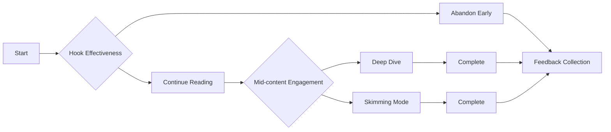

**Agent: Analytics Dashboard Creator**
**Team: Build Team**
**Round: 16**
**Date: 2026-03-12**

**Mission:** Create intuitive, actionable visualizations of reader metrics that enable the team to identify patterns and make data-driven decisions for white paper improvements.

---

## Task Overview
I will build comprehensive analytics dashboards that transform reader simulation data into actionable insights, enabling R&D and White Paper teams to make informed decisions about content improvements.

## Dashboard Suite Design

### 1. Overview Dashboard
**Real-time metrics snapshot:**
- Total readers across all papers
- Average comprehension scores by paper
- Engagement trends over time
- Sentiment summary across reader personas

**Key Visualization Components:**
```typescript
interface OverviewWidgets {
  metrics_cards: {
    total_readers: MetricCard;
    avg_completion_rate: MetricCard;
    global_satisfaction: MetricCard;
    trending_paper: TrendingCard;
  };
  charts: {
    readership_timeline: LineChart;
    comprehension_heatmap: HeatmapChart;
    engagement_regions: GeographicMap;
    persona_distribution: PieChart;
  };
}
```

### 2. Paper-Specific Analysis Dashboard
**Deep dive into each white paper:**

**Tab 1: Comprehension Analysis**
- Section-by-section understanding scores
- Concept difficulty progression chart
- Knowledge retention curves
- Common confusion points visualization

**Tab 2: Engagement Patterns**
- Time spent per section
- Heat map of reader interactions
- Drop-off point identification
- Rereading frequency patterns

**Tab 3: Reader Persona Comparison**
- Side-by-side persona performance indicators
- Differentiated comprehension metrics
- Engagement style variations
- Preference analysis by reader type

### 3. Feedback Analysis Dashboard
**Granular feedback insights:**

**Feedback Types Distribution:**
```python
def create_feedback_visualizations():
    # Circular dendrogram for feedback categories
    feedback_tree = Dendrogram(data=feedback_by_category)

    # Word clouds for sentiment analysis
    positive_cloud = WordCloud(feedback_positive)
    negative_cloud = WordCloud(feedback_negative)

    # Trend analysis for recurring issues
    issue_timeline = Timeline(recurring_issues)

    # Priority matrix for action items
    priority_matrix = ScatterMatrix(priority_vs_impact)
```

**Suggestion Implementation Tracking:**
- Pending suggestions by priority
- Implemented vs. rejected feedback ratio
- Time-to-implementation metrics
- Reader satisfaction improvement scores

### 4. Reader Journey Visualizer
**Step-by-step reader interaction timeline:**

**Sankey Diagram - Reader Flow:**


**Interactive Elements:**
- Click on flow segments for detailed metrics
- Filter by reader persona
- Compare A/B test variations
- Drill down to specific sections

### 5. Implementation

**Frontend Framework - React + D3.js:**
```typescript
import { LineChart, HeatMap, SankeyDiagram } from './components';

const ReaderAnalyticsDashboard: React.FC = () => {
  const { data, loading } = useReaderData();

  return (
    <DashboardLayout>
      <MetricsPanel>
        <CompletionRateCard value={data.completion_rate} />
        <ComprehensionScoreChart data={data.comprehension} />
        <EngagementHeatmap data={data.engagement} />
      </MetricsPanel>
      <TabContainer>
        <Tab label="Overview"><OverviewView data={data} /></Tab>
        <Tab label="Papers"><PapersView data={data.papers} /></Tab>
        <Tab label="Feedback"><FeedbackView data={data.feedback} /></Tab>
        <Tab label="Journeys"><JourneyView data={data.flows} /></Tab>
      </TabContainer>
    </DashboardLayout>
  );
};
```

**Backend API Design:**
```typescript
// Express.js API for dashboard data
app.get('/api/analytics/overview', async (req, res) => {
  const timeframe = req.query.period || '7d';
  const data = await aggregateOverviewData(timeframe);
  res.json(data);
});

app.get('/api/analytics/paper/:id', async (req, res) => {
  const paperData = await getPaperAnalytics(req.params.id);
  res.json(paperData);
});

app.get('/api/analytics/feedback', async (req, res) => {
  const { category, priority } = req.query;
  const feedback = await aggregateFeedbackData({ category, priority });
  res.json(feedback);
});
```

**Data Pipeline for Real-time Updates:**
```python
# WebSocket for live dashboard updates
from flask_socketio import SocketIO, emit

@socketio.on('subscribe_dashboard')
def handle_subscription(data):
    dashboard_id = data['dashboard_id']
    join_room(dashboard_id)

    # Emit updates as they arrive
    def dashboard_update_handler(update):
        emit('dashboard_update', update, room=dashboard_id)

    # Register handler for new data
    register_handler(dashboard_id, dashboard_update_handler)
```

### 6. User Experience Features

**Interactive Filtering:**
- Date range selection
- Reader persona filtering
- Paper-wise comparison
- Section-specific drilling

**Export Capabilities:**
- PDF report generation
- Excel/CSV data export
- PNG/SVG chart downloads
- Scheduled report delivery

**Collaboration Tools:**
- Dashboard sharing
- Comment threads on metrics
- Notification alerts
- Action item tracking

---

**Onboarding Document:** Will include dashboard usage guides, data interpretation methodology, and customization instructions for team-specific needs."}