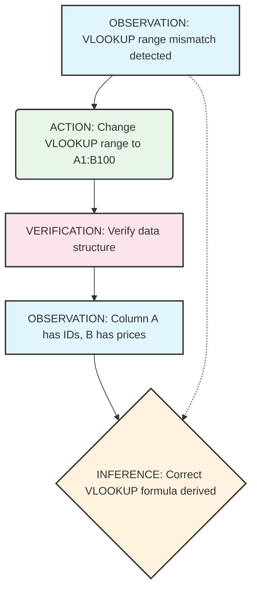

# Reasoning Extraction Specifications for POLLN

**"From Black Box to Glass Box: Parsing LLM Responses into Reusable Reasoning Cells"**

---

## Executive Summary

This document specifies how POLLN extracts discrete, reusable reasoning steps from LLM responses. The core challenge is that LLMs output natural language that **contains** reasoning rather than structured reasoning artifacts. Our system bridges this gap through multi-layered extraction, classification, and validation.

**Design Philosophy**: "Every reasoning step is a potential cell in the spreadsheet of intelligence."

**Phase Status**: ✅ Specification Complete
**Target Integration**: Spreadsheet Integration (Phase 1)
**Dependencies**: A2APackage System, MockLLMBackend, Cell Type System

---

## Table of Contents

1. [Problem Statement](#problem-statement)
2. [Core Type Definitions](#core-type-definitions)
3. [Reasoning Step Detection](#reasoning-step-detection)
4. [Extraction Algorithms](#extraction-algorithms)
5. [Step Type Taxonomy](#step-type-taxonomy)
6. [Ambiguity Handling](#ambiguity-handling)
7. [Cross-LLM Compatibility](#cross-llm-compatibility)
8. [Output Format & Storage](#output-format--storage)
9. [Visualization & Debugging](#visualization--debugging)
10. [Real-World Examples](#real-world-examples)

---

## Problem Statement

### The Core Challenge

LLMs (GPT-4, Claude, Gemini, etc.) produce responses like:

```
To solve this problem, I need to first understand the requirements.
Based on the user's request, they want X. Therefore, I should Y.
However, I need to consider Z before finalizing the approach.
```

This is **natural language containing reasoning**, not **structured reasoning steps**.

### What We Need

Discrete, reusable reasoning cells that can:

1. **Be inspected individually** - Each step is transparent
2. **Be reordered** - Steps can be rearranged for different contexts
3. **Be reused** - Steps can be applied to similar problems
4. **Be validated** - Each step's logic can be verified
5. **Be traced** - Full lineage from input to output

### The Gap

```
LLM Output (Natural Language)
    ↓
[EXTRACTION LAYER]
    ↓
Reasoning Steps (Structured Cells)
    ↓
[REASSEMBLY LAYER]
    ↓
Final Answer (with Traceability)
```

---

## Core Type Definitions

### ReasoningStep Interface

```typescript
/**
 * A single, atomic reasoning step extracted from LLM output
 *
 * Each step represents one logical unit of reasoning that can be:
 * - Inspected independently
 * - Validated for correctness
 * - Reused in similar contexts
 * - Composed with other steps
 */
export interface ReasoningStep {
  // ==========================================================================
  // Identity & Sequence
  // ==========================================================================

  /**
   * Unique identifier for this step
   * Format: "step-{uuid}-{sequence}"
   */
  id: string;

  /**
   * Position in the reasoning chain
   * Starts at 1, increments monotonically
   */
  sequence: number;

  /**
   * ID of the parent LLM response
   * Links step to source response
   */
  responseId: string;

  /**
   * ID of the causal chain (from A2APackage)
   * Enables traceability across agents
   */
  causalChainId: string;

  // ==========================================================================
  // Content
  // ==========================================================================

  /**
   * Raw text from LLM response
   * Exact substring for reproducibility
   */
  rawText: string;

  /**
   * Character offsets in original response
   * For precise slicing and highlighting
   */
  charOffset: {
    start: number;
    end: number;
  };

  /**
   * System-generated summary
   * Concise description of what this step does
   */
  summary: string;

  /**
   * Step type classification
   * Determines how step is processed and validated
   */
  type: StepType;

  /**
   * Step subtype (optional)
   * More granular classification within type
   */
  subtype?: string;

  // ==========================================================================
  // Dependencies
  // ==========================================================================

  /**
   * IDs of steps this step depends on
   * Must complete before this step can execute
   */
  dependsOn: string[];

  /**
   * IDs of steps that depend on this step
   * Populated during dependency resolution
   */
  produces: string[];

  /**
   * Dependency type
   * How the dependency relationship works
   */
  dependencyType: 'sequential' | 'parallel' | 'conditional' | 'iterative';

  // ==========================================================================
  // Extracted Components
  // ==========================================================================

  /**
   * References to inputs used in this step
   * Data, assumptions, prior results
   */
  inputs: ExtractedReference[];

  /**
   * References to outputs produced
   * Intermediate results, conclusions
   */
  outputs: ExtractedReference[];

  /**
   * External references
   * Documents, APIs, knowledge bases
   */
  externalReferences: ExternalReference[];

  // ==========================================================================
  // Quality Metrics
  // ==========================================================================

  /**
   * Confidence in extraction accuracy
   * 0-1 scale, estimated by extractor
   */
  extractionConfidence: number;

  /**
   * Confidence in reasoning correctness
   * 0-1 scale, estimated by validator
   */
  reasoningConfidence: number;

  /**
   * Completeness of step
   * 0-1 scale, is step self-contained?
   */
  completeness: number;

  /**
   * Validation status
   * Has this step been checked?
   */
  validationStatus: 'pending' | 'validated' | 'invalid' | 'uncertain';

  /**
   * Validation errors (if any)
   * Specific issues found during validation
   */
  validationErrors: ValidationError[];

  // ==========================================================================
  // Metadata
  // ==========================================================================

  /**
   * Timestamp when step was extracted
   */
  extractedAt: number;

  /**
   * Timestamp when step was last modified
   */
  updatedAt: number;

  /**
   * Extraction method used
   * How was this step identified?
   */
  extractionMethod: ExtractionMethod;

  /**
   * LLM that produced this step
   * For pattern analysis
   */
  sourceModel: SourceModel;

  /**
   * Tags for categorization
   * User-defined and system-generated
   */
  tags: string[];

  /**
   * Custom metadata
   * Extensible key-value storage
   */
  metadata: Record<string, unknown>;
}

/**
 * Classification of reasoning step types
 *
 * Each type has specific:
 * - Extraction patterns
 * - Validation rules
 * - Reuse criteria
 * - Visualization style
 */
export enum StepType {
  // ==========================================================================
  // Foundational Types
  // ==========================================================================

  /**
   * Direct observation or fact statement
   * "The data shows X", "We observe that Y"
   */
  OBSERVATION = 'observation',

  /**
   * Interpretation or explanation
   * "This means that...", "The implication is..."
   */
  ANALYSIS = 'analysis',

  /**
   * Logical deduction or conclusion
   * "Therefore...", "Thus we can conclude..."
   */
  INFERENCE = 'inference',

  /**
   * Proposed action or operation
   * "We should...", "Let's try..."
   */
  ACTION = 'action',

  /**
   * Self-check or verification
   * "Let's verify...", "Checking that..."
   */
  VERIFICATION = 'verification',

  // ==========================================================================
  // Complex Types
  // ==========================================================================

  /**
   * Comparing multiple options
   * "Comparing A vs B, we see..."
   */
  COMPARISON = 'comparison',

  /**
   * Handling edge cases or errors
   * "However, if X fails..."
   */
  CONTINGENCY = 'contingency',

  /**
   * Synthesizing multiple inputs
   * "Combining X, Y, and Z..."
   */
  SYNTHESIS = 'synthesis',

  /**
   * Breaking down complex problem
   * "We can decompose this into..."
   */
  DECOMPOSITION = 'decomposition',

  /**
   * Questioning assumptions
   * "But wait, is X really true?"
   */
  METACOGNITION = 'metacognition',

  // ==========================================================================
  // Special Types
  // ==========================================================================

  /**
   * Citation or reference
   * "According to [source]..."
   */
  CITATION = 'citation',

  /**
   * Definition or clarification
   * "By X we mean...", "X is defined as..."
   */
  DEFINITION = 'definition',

  /**
   * Example or illustration
   * "For example...", "To illustrate..."
   */
  EXAMPLE = 'example',

  /**
   * Assumption statement
   * "Assuming that...", "Under the assumption..."
   */
  ASSUMPTION = 'assumption',

  /**
   * Unknown/uncertain
   * When extraction cannot classify
   */
  UNKNOWN = 'unknown'
}

/**
 * Reference to data used/produced by a step
 */
export interface ExtractedReference {
  /**
   * Reference identifier
   */
  id: string;

  /**
   * Reference type
   */
  type: 'data' | 'result' | 'assumption' | 'external';

  /**
   * Reference description
   */
  description: string;

  /**
   * Where reference appears in step
   */
  charOffset: {
    start: number;
    end: number;
  };

  /**
   * Confidence this is a real reference
   */
  confidence: number;

  /**
   * Is this reference resolved?
   */
  resolved: boolean;

  /**
   * If resolved, what does it point to?
   */
  target?: string;
}

/**
 * External reference (document, API, etc.)
 */
export interface ExternalReference {
  /**
   * Reference type
   */
  type: 'url' | 'document' | 'api' | 'knowledge_base' | 'citation';

  /**
   * Reference identifier
   */
  id: string;

  /**
   * Reference content/location
   */
  content: string;

  /**
   * Is reference accessible?
   */
  accessible: boolean;

  /**
   * Has reference been verified?
   */
  verified: boolean;
}

/**
 * Validation error details
 */
export interface ValidationError {
  /**
   * Error type
   */
  type: 'logical' | 'factual' | 'consistency' | 'completeness';

  /**
   * Error severity
   */
  severity: 'error' | 'warning' | 'info';

  /**
   * Error message
   */
  message: string;

  /**
   * Where error occurs in step
   */
  location?: {
    start: number;
    end: number;
  };

  /**
   * Suggested fix
   */
  suggestion?: string;
}

/**
 * Extraction method used
 */
export enum ExtractionMethod {
  /**
   * Pattern-based regex matching
   */
  PATTERN = 'pattern',

  /**
   * LLM-assisted extraction
   */
  LLM_ASSISTED = 'llm_assisted',

  /**
   * Heuristic rules
   */
  HEURISTIC = 'heuristic',

  /**
   * Hybrid approach
   */
  HYBRID = 'hybrid',

  /**
   * Manual annotation
   */
  MANUAL = 'manual'
}

/**
 * Source LLM information
 */
export interface SourceModel {
  /**
   * Model family (GPT, Claude, etc.)
   */
  family: 'openai' | 'anthropic' | 'google' | 'meta' | 'other';

  /**
   * Model name
   */
  name: string;

  /**
   * Model version
   */
  version: string;

  /**
   * Confidence in source identification
   */
  confidence: number;
}
```

### ReasoningChain Interface

```typescript
/**
 * Complete reasoning chain from an LLM response
 *
 * Contains all steps with their relationships,
 * enabling full traceability and reusability.
 */
export interface ReasoningChain {
  /**
   * Chain identifier
   */
  id: string;

  /**
   * Original LLM response
   */
  originalResponse: string;

  /**
   * Extracted steps (ordered)
   */
  steps: ReasoningStep[];

  /**
   * Dependency graph
   * Adjacency list representation
   */
  dependencies: Map<string, string[]>;

  /**
   * Chain-level metadata
   */
  metadata: {
    /**
     * Total steps extracted
     */
    stepCount: number;

    /**
     * Extraction confidence (aggregate)
     */
    extractionConfidence: number;

    /**
     * Processing time (ms)
     */
    processingTimeMs: number;

    /**
     * Source model
     */
    sourceModel: SourceModel;

    /**
     * Extraction method used
     */
    extractionMethod: ExtractionMethod;

    /**
     * Timestamp
     */
    extractedAt: number;
  };

  /**
   * Chain-level quality metrics
   */
  quality: {
    /**
     * Coherence of steps
     */
    coherence: number;

    /**
     * Completeness of extraction
     */
    completeness: number;

    /**
     * Validation status
     */
    validationStatus: 'pending' | 'validated' | 'invalid';

    /**
     * Validation errors
     */
    errors: ValidationError[];
  };

  /**
   * Reusability score
   * How likely can this chain be reused?
   */
  reusability: {
    /**
     * Overall reusability (0-1)
     */
    score: number;

    /**
     * Reusable step count
     */
    reusableSteps: number;

    /**
     * Reuse categories
     */
    categories: string[];

    /**
     * Similar chains (by ID)
     */
    similarChains: string[];
  };
}
```

---

## Reasoning Step Detection

### Detection Signals

Reasoning steps are identified through multiple signal sources:

#### 1. Linguistic Markers

```typescript
/**
 * Common linguistic markers for reasoning steps
 *
 * Organized by step type for pattern matching
 */
export const LINGUISTIC_MARKERS = {
  [StepType.OBSERVATION]: [
    'we observe',
    'the data shows',
    'noticing that',
    'we can see',
    'it appears that',
    'first',
    'initially'
  ],

  [StepType.ANALYSIS]: [
    'this means',
    'this suggests',
    'the implication is',
    'interpreting this',
    'analyzing',
    'breaking down'
  ],

  [StepType.INFERENCE]: [
    'therefore',
    'thus',
    'consequently',
    'as a result',
    'we can conclude',
    'it follows that',
    'so',
    'hence'
  ],

  [StepType.ACTION]: [
    'we should',
    'let\'s',
    'the next step is',
    'we need to',
    'our approach will be',
    'implementing'
  ],

  [StepType.VERIFICATION]: [
    'let\'s verify',
    'checking',
    'confirming',
    'validating',
    'to ensure',
    'making sure'
  ],

  [StepType.COMPARISON]: [
    'comparing',
    'on the other hand',
    'alternatively',
    'in contrast',
    'while',
    'whereas'
  ],

  [StepType.CONTINGENCY]: [
    'however',
    'but if',
    'in case',
    'should this fail',
    'as a fallback',
    'otherwise'
  ],

  [StepType.SYNTHESIS]: [
    'combining',
    'integrating',
    'bringing together',
    'synthesizing',
    'merging'
  ],

  [StepType.DECOMPOSITION]: [
    'we can break this into',
    'decomposing',
    'splitting into',
    'dividing into',
    'separating into'
  ],

  [StepType.METACOGNITION]: [
    'but wait',
    'questioning',
    'reconsidering',
    'is this really',
    'on second thought'
  ],

  [StepType.CITATION]: [
    'according to',
    'as stated in',
    'based on',
    'referencing',
    'citing'
  ],

  [StepType.DEFINITION]: [
    'by',
    'we mean',
    'is defined as',
    'refers to',
    'means that'
  ],

  [StepType.EXAMPLE]: [
    'for example',
    'for instance',
    'to illustrate',
    'consider',
    'an example of'
  ],

  [StepType.ASSUMPTION]: [
    'assuming',
    'under the assumption',
    'presuming',
    'given that',
    'taking for granted'
  ]
};
```

#### 2. Structural Patterns

```typescript
/**
 * Structural patterns indicating reasoning steps
 *
 * These patterns appear in LLM output regardless
 * of the specific linguistic markers used
 */
export const STRUCTURAL_PATTERNS = {
  /**
   * Numbered lists (explicit step sequences)
   */
  NUMBERED_LIST: /^(\d+\.|\d+\))\s+/m,

  /**
   * Bulleted lists (parallel steps)
   */
  BULLETED_LIST: /^[\-\*•]\s+/m,

  /**
   * Paragraph breaks (step boundaries)
   */
  PARAGRAPH_BREAK: /\n\n+/,

  /**
   * Transition phrases (step connections)
   */
  TRANSITION: /\b(first|second|third|next|then|finally|lastly)\b/i,

  /**
   * Causal connectors (inference chains)
   */
  CAUSAL: /\b(because|therefore|thus|consequently|so|hence)\b/i,

  /**
   * Contrast connectors (branching)
   */
  CONTRAST: /\b(however|but|although|nevertheless|conversely)\b/i,

  /**
   * Conditional connectors (contingencies)
   */
  CONDITIONAL: /\b(if|when|whenever|unless|provided that)\b/i
};
```

#### 3. Semantic Boundaries

```typescript
/**
 * Semantic boundary detection
 *
 * Uses embeddings and semantic similarity to detect
 * topic shifts that indicate step boundaries
 */
export interface SemanticBoundary {
  /**
   * Position of boundary (character offset)
   */
  position: number;

  /**
   * Confidence this is a real boundary
   */
  confidence: number;

  /**
   * Topic before boundary
   */
  topicBefore: {
    keywords: string[];
    embedding: number[];
  };

  /**
   * Topic after boundary
   */
  topicAfter: {
    keywords: string[];
    embedding: number[];
  };

  /**
   * Semantic distance between topics
   */
  semanticDistance: number;
}
```

### Step Boundary Algorithm

```typescript
/**
 * Algorithm: Detect reasoning step boundaries
 *
 * Combines multiple signal sources for robust detection
 */
export function detectStepBoundaries(
  response: string,
  options: {
    useLinguisticMarkers: boolean;
    useStructuralPatterns: boolean;
    useSemanticBoundaries: boolean;
    minStepLength: number;
    maxStepLength: number;
  }
): number[] {
  const boundaries: number[] = [];
  const signals: number[][] = [];

  // 1. Linguistic marker signals
  if (options.useLinguisticMarkers) {
    const markerPositions = findLinguisticMarkers(response);
    signals.push(markerPositions);
  }

  // 2. Structural pattern signals
  if (options.useStructuralPatterns) {
    const structuralPositions = findStructuralPatterns(response);
    signals.push(structuralPositions);
  }

  // 3. Semantic boundary signals
  if (options.useSemanticBoundaries) {
    const semanticBoundaries = detectSemanticBoundaries(response);
    signals.push(semanticBoundaries.map(b => b.position));
  }

  // 4. Combine signals with voting
  const merged = mergeSignals(signals, {
    window: 50,  // Merge within 50 chars
    minVotes: 2  // At least 2 signal types
  });

  // 5. Validate boundaries
  const valid = merged.filter(pos => {
    const length = pos - (boundaries[boundaries.length - 1] || 0);
    return length >= options.minStepLength &&
           length <= options.maxStepLength;
  });

  return valid;
}

/**
 * Merge nearby signals from multiple sources
 *
 * Uses a sliding window to combine signals that
 * are close together, requiring minimum votes
 */
function mergeSignals(
  signals: number[][],
  options: { window: number; minVotes: number }
): number[] {
  const merged: number[] = [];
  const all = signals.flat().sort((a, b) => a - b);

  let windowStart = all[0];
  let windowVotes = 0;
  let windowSignals: Set<number> = new Set();

  for (const pos of all) {
    if (pos - windowStart <= options.window) {
      // Within window, accumulate votes
      windowSignals.add(pos);
      windowVotes = windowSignals.size;
    } else {
      // Window ended, check if enough votes
      if (windowVotes >= options.minVotes) {
        const center = Array.from(windowSignals)
          .reduce((sum, p) => sum + p, 0) / windowSignals.size;
        merged.push(Math.round(center));
      }

      // Start new window
      windowStart = pos;
      windowSignals.clear();
      windowSignals.add(pos);
      windowVotes = 1;
    }
  }

  // Don't forget last window
  if (windowVotes >= options.minVotes) {
    const center = Array.from(windowSignals)
      .reduce((sum, p) => sum + p, 0) / windowSignals.size;
    merged.push(Math.round(center));
  }

  return merged;
}
```

### Nested Reasoning Detection

```typescript
/**
 * Detect nested reasoning (reasoning within reasoning)
 *
 * Example:
 * "We should use approach X. This works because [Y happens],
 *  and Y happens because [Z is true]."
 *
 * Outer: Action (use X)
 * Inner: Analysis (X works because Y)
 *   Inner-Inner: Analysis (Y because Z)
 */
export interface NestedReasoning {
  /**
   * Nesting level (0 = top-level)
   */
  level: number;

  /**
   * Parent step ID
   */
  parentId?: string;

  /**
   * Child step IDs
   */
  childIds: string[];

  /**
   * Nesting type
   */
  type: 'elaboration' | 'justification' | 'clarification' | 'example';

  /**
   * Character span of nested section
   */
  span: {
    start: number;
    end: number;
  };
}

/**
 * Algorithm: Detect nested reasoning
 *
 * Looks for patterns that indicate nesting
 */
export function detectNestedReasoning(
  response: string,
  topLevelSteps: ReasoningStep[]
): NestedReasoning[] {
  const nested: NestedReasoning[] = [];

  for (const step of topLevelSteps) {
    // Look for elaboration markers
    const elaborationPatterns = [
      /because\s+(.+)/i,
      /since\s+(.+)/i,
      /as\s+(a\s+)?result\s+(.+)/i
    ];

    // Look for clarification markers
    const clarificationPatterns = [
      /specifically,\s*(.+)/i,
      /in\s+other\s+words,\s*(.+)/i,
      /that\s+is,\s*(.+)/i
    ];

    // Look for example markers
    const examplePatterns = [
      /for\s+example,\s*(.+)/i,
      /for\s+instance,\s*(.+)/i,
      /to\s+illustrate,\s*(.+)/i
    ];

    // Check for nested content
    for (const pattern of [...elaborationPatterns, ...claribrationPatterns, ...examplePatterns]) {
      const match = step.rawText.match(pattern);
      if (match) {
        nested.push({
          level: 1,
          parentId: step.id,
          childIds: [],  // Will be populated during extraction
          type: pattern === elaborationPatterns[0] ? 'justification' :
                pattern === clarificationPatterns[0] ? 'clarification' :
                'example',
          span: {
            start: step.charOffset.start + match.index!,
            end: step.charOffset.start + match.index! + match[0].length
          }
        });
      }
    }
  }

  return nested;
}
```

---

## Extraction Algorithms

### Overview

We use a **hybrid approach** combining three methods:

1. **Pattern Matching** - Fast, rule-based extraction
2. **LLM-Assisted** - High accuracy, slower
3. **Heuristic Rules** - Fallback for ambiguous cases

### Algorithm 1: Pattern-Based Extraction

```typescript
/**
 * Algorithm: Pattern-based extraction
 *
 * Fast, rule-based extraction using linguistic markers
 * and structural patterns. Best for well-structured responses.
 */
export class PatternExtractor {
  private patterns: Map<StepType, RegExp[]>;

  constructor() {
    this.patterns = this.compilePatterns();
  }

  /**
   * Extract reasoning steps using pattern matching
   */
  extract(response: string): ReasoningStep[] {
    const steps: ReasoningStep[] = [];
    const boundaries = this.findBoundaries(response);

    for (let i = 0; i < boundaries.length - 1; i++) {
      const start = boundaries[i];
      const end = boundaries[i + 1];
      const text = response.slice(start, end).trim();

      if (text.length < 10) continue;  // Skip too short

      const step = this.createStep(text, start, end, i);
      steps.push(step);
    }

    return this.resolveDependencies(steps);
  }

  /**
   * Find step boundaries using patterns
   */
  private findBoundaries(response: string): number[] {
    const boundaries: number[] = [0];

    // Try each pattern type
    for (const [stepType, patterns] of this.patterns) {
      for (const pattern of patterns) {
        let match;
        while ((match = pattern.exec(response)) !== null) {
          boundaries.push(match.index);
        }
      }
    }

    // Remove duplicates and sort
    return [...new Set(boundaries)].sort((a, b) => a - b);
  }

  /**
   * Create reasoning step from text
   */
  private createStep(
    text: string,
    start: number,
    end: number,
    sequence: number
  ): ReasoningStep {
    const type = this.classifyStep(text);
    const summary = this.generateSummary(text, type);

    return {
      id: `step-${uuidv4()}-${sequence}`,
      sequence,
      responseId: '',  // Set by caller
      causalChainId: '',  // Set by caller
      rawText: text,
      charOffset: { start, end },
      summary,
      type,
      dependsOn: [],
      produces: [],
      dependencyType: 'sequential',
      inputs: this.extractInputs(text),
      outputs: this.extractOutputs(text),
      externalReferences: this.extractReferences(text),
      extractionConfidence: this.estimateConfidence(text, type),
      reasoningConfidence: 0.5,  // Will be validated
      completeness: this.estimateCompleteness(text),
      validationStatus: 'pending',
      validationErrors: [],
      extractedAt: Date.now(),
      updatedAt: Date.now(),
      extractionMethod: ExtractionMethod.PATTERN,
      sourceModel: {
        family: 'other',
        name: 'unknown',
        version: 'unknown',
        confidence: 0
      },
      tags: this.generateTags(text, type),
      metadata: {}
    };
  }

  /**
   * Classify step type from text
   */
  private classifyStep(text: string): StepType {
    const scores = new Map<StepType, number>();

    // Score each step type
    for (const [type, markers] of Object.entries(LINGUISTIC_MARKERS)) {
      let score = 0;
      const lowerText = text.toLowerCase();

      for (const marker of markers) {
        if (lowerText.includes(marker)) {
          score += 1;
        }
      }

      scores.set(type as StepType, score);
    }

    // Return highest scoring type
    let maxScore = 0;
    let maxType = StepType.UNKNOWN;

    for (const [type, score] of scores) {
      if (score > maxScore) {
        maxScore = score;
        maxType = type;
      }
    }

    return maxType;
  }

  /**
   * Generate summary from text
   */
  private generateSummary(text: string, type: StepType): string {
    // Extract first sentence
    const firstSentence = text.split(/[.!?]/)[0].trim();

    // Truncate if too long
    if (firstSentence.length > 100) {
      return firstSentence.slice(0, 97) + '...';
    }

    return firstSentence;
  }

  /**
   * Estimate extraction confidence
   */
  private estimateConfidence(text: string, type: StepType): number {
    let confidence = 0.5;

    // Boost if clear markers present
    const markers = LINGUISTIC_MARKERS[type];
    const lowerText = text.toLowerCase();
    const markerCount = markers.filter(m => lowerText.includes(m)).length;
    confidence += markerCount * 0.1;

    // Boost if well-structured
    if (text.length > 20 && text.length < 200) {
      confidence += 0.1;
    }

    // Cap at 1.0
    return Math.min(1.0, confidence);
  }

  /**
   * Estimate completeness
   */
  private estimateCompleteness(text: string): number {
    let completeness = 0.5;

    // Boost if has complete sentences
    if (text.match(/^[A-Z].*[.!?]$/)) {
      completeness += 0.2;
    }

    // Boost if explains reasoning
    if (text.match(/because|therefore|thus|so|because/i)) {
      completeness += 0.2;
    }

    // Cap at 1.0
    return Math.min(1.0, completeness);
  }

  /**
   * Resolve dependencies between steps
   */
  private resolveDependencies(steps: ReasoningStep[]): ReasoningStep[] {
    for (let i = 1; i < steps.length; i++) {
      const current = steps[i];
      const previous = steps[i - 1];

      // Check for dependency indicators
      const hasDependency = current.rawText.match(
        /therefore|thus|consequently|as a result|based on|given/i
      );

      if (hasDependency) {
        current.dependsOn.push(previous.id);
        previous.produces.push(current.id);
        current.dependencyType = 'sequential';
      }
    }

    return steps;
  }

  /**
   * Compile patterns from markers
   */
  private compilePatterns(): Map<StepType, RegExp[]> {
    const patterns = new Map<StepType, RegExp[]>();

    for (const [type, markers] of Object.entries(LINGUISTIC_MARKERS)) {
      const regexes = markers.map(marker =>
        new RegExp(`\\b${marker}\\b`, 'gi')
      );
      patterns.set(type as StepType, regexes);
    }

    return patterns;
  }

  /**
   * Extract input references
   */
  private extractInputs(text: string): ExtractedReference[] {
    const inputs: ExtractedReference[] = [];

    // Look for data references
    const dataPatterns = [
      /the\s+data\s+shows?\s+(.+?)(?:\.|$)/i,
      /we\s+observe\s+(.+?)(?:\.|$)/i,
      /(.+?)\s+indicates?\s+(.+?)(?:\.|$)/i
    ];

    for (const pattern of dataPatterns) {
      const match = text.match(pattern);
      if (match) {
        inputs.push({
          id: `input-${uuidv4()}`,
          type: 'data',
          description: match[0],
          charOffset: {
            start: match.index!,
            end: match.index! + match[0].length
          },
          confidence: 0.8,
          resolved: false
        });
      }
    }

    return inputs;
  }

  /**
   * Extract output references
   */
  private extractOutputs(text: string): ExtractedReference[] {
    const outputs: ExtractedReference[] = [];

    // Look for conclusion markers
    const conclusionPatterns = [
      /therefore,?\s+(.+?)(?:\.|$)/i,
      /thus,?\s+(.+?)(?:\.|$)/i,
      /we\s+can\s+conclude\s+(.+?)(?:\.|$)/i
    ];

    for (const pattern of conclusionPatterns) {
      const match = text.match(pattern);
      if (match) {
        outputs.push({
          id: `output-${uuidv4()}`,
          type: 'result',
          description: match[0],
          charOffset: {
            start: match.index!,
            end: match.index! + match[0].length
          },
          confidence: 0.8,
          resolved: false
        });
      }
    }

    return outputs;
  }

  /**
   * Extract external references
   */
  private extractReferences(text: string): ExternalReference[] {
    const refs: ExternalReference[] = [];

    // URLs
    const urls = text.match(/https?:\/\/[^\s]+/g);
    if (urls) {
      for (const url of urls) {
        refs.push({
          type: 'url',
          id: `ref-${uuidv4()}`,
          content: url,
          accessible: false,  // Not checked yet
          verified: false
        });
      }
    }

    // Citations
    const citations = text.match(/\[.+?\]/g);
    if (citations) {
      for (const citation of citations) {
        refs.push({
          type: 'citation',
          id: `ref-${uuidv4()}`,
          content: citation,
          accessible: false,
          verified: false
        });
      }
    }

    return refs;
  }

  /**
   * Generate tags for step
   */
  private generateTags(text: string, type: StepType): string[] {
    const tags: string[] = [type];

    // Add domain-specific tags
    if (text.match(/data|statistics|numbers/)) {
      tags.push('data-driven');
    }

    if (text.match(/algorithm|method|approach/)) {
      tags.push('methodological');
    }

    if (text.match(/user|customer|person/)) {
      tags.push('user-centric');
    }

    return tags;
  }
}
```

### Algorithm 2: LLM-Assisted Extraction

```typescript
/**
 * Algorithm: LLM-assisted extraction
 *
 * Uses a smaller LLM to parse and classify reasoning steps.
 * Higher accuracy but slower and more expensive.
 */
export class LLMAssistedExtractor {
  private llm: LLMBackend;  // Could use smaller model like GPT-3.5

  constructor(llm: LLMBackend) {
    this.llm = llm;
  }

  /**
   * Extract reasoning steps using LLM assistance
   */
  async extract(response: string): Promise<ReasoningStep[]> {
    // Step 1: Ask LLM to identify step boundaries
    const boundaries = await this.identifyBoundaries(response);

    // Step 2: Extract each step and classify
    const steps: ReasoningStep[] = [];
    for (let i = 0; i < boundaries.length - 1; i++) {
      const start = boundaries[i];
      const end = boundaries[i + 1];
      const text = response.slice(start, end).trim();

      const step = await this.extractStep(text, start, end, i);
      steps.push(step);
    }

    // Step 3: Resolve dependencies
    return await this.resolveDependencies(steps);
  }

  /**
   * Identify step boundaries using LLM
   */
  private async identifyBoundaries(response: string): Promise<number[]> {
    const prompt = `
Identify the boundaries between reasoning steps in the following text.
Return a JSON array of character positions where one step ends and another begins.

Text:
${response}

Rules:
- Start with 0 (beginning)
- End with ${response.length} (end)
- Look for shifts in focus, new actions, or logical transitions
- Return only the JSON array

Example output: [0, 45, 120, 250, 400]
`;

    const result = await this.llm.generateTokens({
      prompt,
      maxTokens: 100,
      temperature: 0.1
    });

    try {
      const boundaries = JSON.parse(result.text);
      return boundaries as number[];
    } catch {
      // Fallback: return start and end
      return [0, response.length];
    }
  }

  /**
   * Extract and classify a single step
   */
  private async extractStep(
    text: string,
    start: number,
    end: number,
    sequence: number
  ): Promise<ReasoningStep> {
    const prompt = `
Analyze this reasoning step and extract its components.

Text:
${text}

Return a JSON object with:
{
  "type": "observation|analysis|inference|action|verification|comparison|contingency|synthesis|decomposition|metacognition|citation|definition|example|assumption|unknown",
  "summary": "one-sentence summary",
  "inputs": ["list of inputs referenced"],
  "outputs": ["list of outputs produced"],
  "confidence": 0.0-1.0,
  "completeness": 0.0-1.0
}
`;

    const result = await this.llm.generateTokens({
      prompt,
      maxTokens: 200,
      temperature: 0.1
    });

    try {
      const analysis = JSON.parse(result.text);

      return {
        id: `step-${uuidv4()}-${sequence}`,
        sequence,
        responseId: '',  // Set by caller
        causalChainId: '',  // Set by caller
        rawText: text,
        charOffset: { start, end },
        summary: analysis.summary || this.generateFallbackSummary(text),
        type: analysis.type || StepType.UNKNOWN,
        dependsOn: [],
        produces: [],
        dependencyType: 'sequential',
        inputs: analysis.inputs.map((inp: string, i: number) => ({
          id: `input-${uuidv4()}`,
          type: 'data',
          description: inp,
          charOffset: { start: 0, end: 0 },  // Not precise
          confidence: 0.8,
          resolved: false
        })),
        outputs: analysis.outputs.map((out: string, i: number) => ({
          id: `output-${uuidv4()}`,
          type: 'result',
          description: out,
          charOffset: { start: 0, end: 0 },  // Not precise
          confidence: 0.8,
          resolved: false
        })),
        externalReferences: [],
        extractionConfidence: analysis.confidence || 0.7,
        reasoningConfidence: 0.5,  // Will be validated
        completeness: analysis.completeness || 0.7,
        validationStatus: 'pending',
        validationErrors: [],
        extractedAt: Date.now(),
        updatedAt: Date.now(),
        extractionMethod: ExtractionMethod.LLM_ASSISTED,
        sourceModel: {
          family: 'other',
          name: this.llm.getConfig().modelId,
          version: 'unknown',
          confidence: 1.0
        },
        tags: [analysis.type],
        metadata: { llmAnalysis: analysis }
      };
    } catch {
      // Fallback to pattern-based
      return this.fallbackExtraction(text, start, end, sequence);
    }
  }

  /**
   * Resolve dependencies using LLM
   */
  private async resolveDependencies(steps: ReasoningStep[]): Promise<ReasoningStep[]> {
    if (steps.length < 2) return steps;

    const prompt = `
Analyze the dependencies between these reasoning steps.

${steps.map((s, i) => `
Step ${i + 1} (${s.type}):
${s.rawText}
`).join('\n')}

Return a JSON array where each element indicates which steps (by number) the step depends on.
For example: [[], [1], [1,2], [3]] means:
- Step 1 has no dependencies
- Step 2 depends on Step 1
- Step 3 depends on Steps 1 and 2
- Step 4 depends on Step 3
`;

    const result = await this.llm.generateTokens({
      prompt,
      maxTokens: 200,
      temperature: 0.1
    });

    try {
      const dependencies = JSON.parse(result.text) as number[][];

      for (let i = 0; i < steps.length; i++) {
        const deps = dependencies[i] || [];
        for (const depNum of deps) {
          if (depNum > 0 && depNum <= i) {
            steps[i].dependsOn.push(steps[depNum - 1].id);
            steps[depNum - 1].produces.push(steps[i].id);
          }
        }
        steps[i].dependencyType = deps.length > 1 ? 'parallel' : 'sequential';
      }

      return steps;
    } catch {
      // Fallback: sequential dependencies
      for (let i = 1; i < steps.length; i++) {
        steps[i].dependsOn.push(steps[i - 1].id);
        steps[i - 1].produces.push(steps[i].id);
        steps[i].dependencyType = 'sequential';
      }
      return steps;
    }
  }

  /**
   * Generate fallback summary
   */
  private generateFallbackSummary(text: string): string {
    const firstSentence = text.split(/[.!?]/)[0].trim();
    return firstSentence.length > 100
      ? firstSentence.slice(0, 97) + '...'
      : firstSentence;
  }

  /**
   * Fallback extraction on LLM failure
   */
  private fallbackExtraction(
    text: string,
    start: number,
    end: number,
    sequence: number
  ): ReasoningStep {
    return {
      id: `step-${uuidv4()}-${sequence}`,
      sequence,
      responseId: '',
      causalChainId: '',
      rawText: text,
      charOffset: { start, end },
      summary: this.generateFallbackSummary(text),
      type: StepType.UNKNOWN,
      dependsOn: [],
      produces: [],
      dependencyType: 'sequential',
      inputs: [],
      outputs: [],
      externalReferences: [],
      extractionConfidence: 0.3,
      reasoningConfidence: 0.5,
      completeness: 0.5,
      validationStatus: 'pending',
      validationErrors: [],
      extractedAt: Date.now(),
      updatedAt: Date.now(),
      extractionMethod: ExtractionMethod.HEURISTIC,
      sourceModel: {
        family: 'other',
        name: 'fallback',
        version: 'unknown',
        confidence: 0
      },
      tags: ['unknown'],
      metadata: {}
    };
  }
}
```

### Algorithm 3: Hybrid Extraction

```typescript
/**
 * Algorithm: Hybrid extraction
 *
 * Combines pattern-based and LLM-assisted extraction
 * for optimal accuracy and performance.
 */
export class HybridExtractor {
  private patternExtractor: PatternExtractor;
  private llmExtractor: LLMAssistedExtractor;
  private cache: Map<string, ReasoningStep[]> = new Map();

  constructor(llm: LLMBackend) {
    this.patternExtractor = new PatternExtractor();
    this.llmExtractor = new LLMAssistedExtractor(llm);
  }

  /**
   * Extract using hybrid approach
   */
  async extract(response: string): Promise<ReasoningStep[]> {
    // Check cache
    const cacheKey = this.hashResponse(response);
    if (this.cache.has(cacheKey)) {
      return this.cache.get(cacheKey)!;
    }

    // Step 1: Try pattern-based extraction (fast)
    const patternSteps = this.patternExtractor.extract(response);

    // Step 2: Assess quality
    const quality = this.assessQuality(patternSteps, response);

    // Step 3: If quality is low, use LLM-assisted
    if (quality.overall < 0.7) {
      console.log('Pattern extraction quality low, using LLM-assisted');
      const llmSteps = await this.llmExtractor.extract(response);

      // Cache and return
      this.cache.set(cacheKey, llmSteps);
      return llmSteps;
    }

    // Step 4: If quality is medium, use LLM to refine
    if (quality.overall < 0.9) {
      console.log('Refining pattern extraction with LLM');
      const refined = await this.refineWithLLM(patternSteps, response);

      // Cache and return
      this.cache.set(cacheKey, refined);
      return refined;
    }

    // High quality, use pattern-based
    this.cache.set(cacheKey, patternSteps);
    return patternSteps;
  }

  /**
   * Assess extraction quality
   */
  private assessQuality(steps: ReasoningStep[], response: string): {
    overall: number;
    confidence: number;
    coverage: number;
    coherence: number;
  } {
    // Average extraction confidence
    const avgConfidence = steps.reduce((sum, s) =>
      sum + s.extractionConfidence, 0) / steps.length;

    // Coverage: how much of response is covered
    const coveredChars = steps.reduce((sum, s) =>
      sum + (s.charOffset.end - s.charOffset.start), 0);
    const coverage = coveredChars / response.length;

    // Coherence: do steps connect logically
    const coherence = this.assessCoherence(steps);

    // Overall quality
    const overall = (avgConfidence + coverage + coherence) / 3;

    return {
      overall,
      confidence: avgConfidence,
      coverage,
      coherence
    };
  }

  /**
   * Assess step coherence
   */
  private assessCoherence(steps: ReasoningStep[]): number {
    if (steps.length < 2) return 1.0;

    let coherenceScore = 0;
    let transitions = 0;

    for (let i = 1; i < steps.length; i++) {
      const prev = steps[i - 1];
      const curr = steps[i];

      // Check for transition words
      const hasTransition = curr.rawText.match(
        /therefore|thus|consequently|however|but|also|furthermore/i
      );

      if (hasTransition) {
        coherenceScore += 1;
      }

      // Check for topic continuity
      const prevTopic = this.extractTopic(prev.rawText);
      const currTopic = this.extractTopic(curr.rawText);
      const topicSimilarity = this.jaccardSimilarity(prevTopic, currTopic);
      coherenceScore += topicSimilarity;

      transitions++;
    }

    return coherenceScore / (transitions * 2);  // Normalize
  }

  /**
   * Refine pattern extraction with LLM
   */
  private async refineWithLLM(
    patternSteps: ReasoningStep[],
    response: string
  ): Promise<ReasoningStep[]> {
    const refined: ReasoningStep[] = [];

    for (const step of patternSteps) {
      // Use LLM to classify uncertain steps
      if (step.extractionConfidence < 0.7) {
        const prompt = `
Classify this reasoning step:

${step.rawText}

Return JSON with:
{
  "type": "step type",
  "confidence": 0.0-1.0,
  "summary": "one-sentence summary"
}
`;

        const result = await this.llmExtractor['llm'].generateTokens({
          prompt,
          maxTokens: 100,
          temperature: 0.1
        });

        try {
          const analysis = JSON.parse(result.text);
          step.type = analysis.type || step.type;
          step.extractionConfidence = analysis.confidence || step.extractionConfidence;
          step.summary = analysis.summary || step.summary;
        } catch {
          // Keep pattern-based values
        }
      }

      refined.push(step);
    }

    return refined;
  }

  /**
   * Extract topic keywords from text
   */
  private extractTopic(text: string): Set<string> {
    const words = text.toLowerCase().match(/\b[a-z]{4,}\b/g) || [];
    const stopWords = new Set([
      'this', 'that', 'with', 'from', 'have', 'been', 'were', 'they',
      'their', 'what', 'when', 'where', 'will', 'than', 'into', 'some'
    ]);

    return new Set(words.filter(w => !stopWords.has(w)));
  }

  /**
   * Jaccard similarity between sets
   */
  private jaccardSimilarity(a: Set<string>, b: Set<string>): number {
    const intersection = new Set([...a].filter(x => b.has(x)));
    const union = new Set([...a, ...b]);

    if (union.size === 0) return 0;
    return intersection.size / union.size;
  }

  /**
   * Hash response for caching
   */
  private hashResponse(response: string): string {
    let hash = 0;
    for (let i = 0; i < response.length; i++) {
      const char = response.charCodeAt(i);
      hash = ((hash << 5) - hash) + char;
      hash = hash & hash;  // Convert to 32-bit integer
    }
    return Math.abs(hash).toString(16);
  }
}
```

---

## Step Type Taxonomy

### Type Classification Tree

```
ReasoningStep
├── Foundational Types
│   ├── OBSERVATION      - Direct observation or fact
│   ├── ANALYSIS         - Interpretation or explanation
│   ├── INFERENCE        - Logical deduction or conclusion
│   ├── ACTION           - Proposed action or operation
│   └── VERIFICATION     - Self-check or verification
│
├── Complex Types
│   ├── COMPARISON       - Comparing multiple options
│   ├── CONTINGENCY      - Handling edge cases or errors
│   ├── SYNTHESIS        - Synthesizing multiple inputs
│   ├── DECOMPOSITION    - Breaking down complex problem
│   └── METACOGNITION    - Questioning assumptions
│
└── Special Types
    ├── CITATION         - Citation or reference
    ├── DEFINITION       - Definition or clarification
    ├── EXAMPLE          - Example or illustration
    ├── ASSUMPTION       - Assumption statement
    └── UNKNOWN          - Uncertain classification
```

### Type-Specific Handling

#### OBSERVATION

```typescript
/**
 * Observation step handling
 *
 * Observations are foundational facts or data points.
 * They don't require justification but may need verification.
 */
export class ObservationHandler {
  /**
   * Validate observation step
   */
  validate(step: ReasoningStep): ValidationError[] {
    const errors: ValidationError[] = [];

    // Check if observation is verifiable
    if (!step.rawText.match(/we observe|the data shows|noticing/i)) {
      errors.push({
        type: 'completeness',
        severity: 'warning',
        message: 'Observation may not be clearly stated'
      });
    }

    // Check if observation is specific
    if (step.rawText.length < 20) {
      errors.push({
        type: 'completeness',
        severity: 'info',
        message: 'Observation is very brief'
      });
    }

    return errors;
  }

  /**
   * Extract data references
   */
  extractDataReferences(step: ReasoningStep): ExtractedReference[] {
    const refs: ExtractedReference[] = [];

    // Look for data mentions
    const patterns = [
      /the\s+data\s+(shows?|indicates?|reveals?)\s+(.+?)(?:\.|$)/i,
      /we\s+observe\s+(.+?)(?:\.|$)/i,
      /(.+?)\s+can\s+be\s+seen\s+(.+?)(?:\.|$)/i
    ];

    for (const pattern of patterns) {
      const match = step.rawText.match(pattern);
      if (match) {
        refs.push({
          id: `data-${uuidv4()}`,
          type: 'data',
          description: match[0],
          charOffset: {
            start: match.index!,
            end: match.index! + match[0].length
          },
          confidence: 0.8,
          resolved: false
        });
      }
    }

    return refs;
  }
}
```

#### INFERENCE

```typescript
/**
 * Inference step handling
 *
 * Inferences are logical conclusions drawn from observations.
 * They require clear logical structure and may need validation.
 */
export class InferenceHandler {
  /**
   * Validate inference step
   */
  validate(step: ReasoningStep): ValidationError[] {
    const errors: ValidationError[] = [];

    // Check for inference markers
    const hasMarkers = step.rawText.match(
      /therefore|thus|consequently|as a result|so|hence/i
    );

    if (!hasMarkers) {
      errors.push({
        type: 'completeness',
        severity: 'warning',
        message: 'Inference may not be clearly marked'
      });
    }

    // Check for logical structure
    const hasPremise = step.rawText.match(/because|since|given that|as/i);
    const hasConclusion = step.rawText.match(/therefore|thus|so/i);

    if (!hasPremise && !hasConclusion) {
      errors.push({
        type: 'logical',
        severity: 'warning',
        message: 'Inference lacks clear logical structure'
      });
    }

    return errors;
  }

  /**
   * Extract logical structure
   */
  extractLogicalStructure(step: ReasoningStep): {
    premises: string[];
    conclusion: string;
    type: 'deductive' | 'inductive' | 'abductive';
  } {
    const premises: string[] = [];
    let conclusion = '';

    // Extract premises (statements before "therefore/thus")
    const parts = step.rawText.split(/\b(therefore|thus|consequently)\b/i);
    if (parts.length > 1) {
      premises.push(parts[0].trim());
      conclusion = parts.slice(1).join(' ').trim();
    }

    // Determine inference type
    let type: 'deductive' | 'inductive' | 'abductive' = 'deductive';

    if (step.rawText.match(/likely|probably|suggests|indicates/i)) {
      type = 'inductive';
    } else if (step.rawText.match(/best\s+explanation|accounts\s+for/i)) {
      type = 'abductive';
    }

    return { premises, conclusion, type };
  }
}
```

#### ACTION

```typescript
/**
 * Action step handling
 *
 * Actions are proposed operations or interventions.
 * They need clear specifications and success criteria.
 */
export class ActionHandler {
  /**
   * Validate action step
   */
  validate(step: ReasoningStep): ValidationError[] {
    const errors: ValidationError[] = [];

    // Check for action markers
    const hasMarkers = step.rawText.match(
      /we should|let's|we need to|our approach will be|implementing/i
    );

    if (!hasMarkers) {
      errors.push({
        type: 'completeness',
        severity: 'warning',
        message: 'Action may not be clearly stated'
      });
    }

    // Check for specificity
    if (step.rawText.length < 30) {
      errors.push({
        type: 'completeness',
        severity: 'info',
        message: 'Action description is brief'
      });
    }

    return errors;
  }

  /**
   * Extract action specification
   */
  extractActionSpec(step: ReasoningStep): {
    verb: string;
    object: string;
    parameters: Record<string, unknown>;
    preconditions: string[];
    postconditions: string[];
  } {
    let verb = '';
    let object = '';
    const parameters: Record<string, unknown> = {};
    const preconditions: string[] = [];
    const postconditions: string[] = [];

    // Extract verb-object structure
    const actionMatch = step.rawText.match(
      /(should|will|need to)\s+(\w+)\s+(.+?)(?:\.|$)/i
    );

    if (actionMatch) {
      verb = actionMatch[2];
      object = actionMatch[3];
    }

    // Extract conditions
    const ifMatches = step.rawText.matchAll(/if\s+(.+?)(?:,|\.|$)/gi);
    for (const match of ifMatches) {
      preconditions.push(match[1].trim());
    }

    const thenMatches = step.rawText.matchAll(/then\s+(.+?)(?:,|\.|$)/gi);
    for (const match of thenMatches) {
      postconditions.push(match[1].trim());
    }

    return { verb, object, parameters, preconditions, postconditions };
  }
}
```

---

## Ambiguity Handling

### Implicit Reasoning

```typescript
/**
 * Handle implicit reasoning (skipped steps)
 *
 * LLMs often skip intermediate reasoning steps.
 * We need to detect and fill these gaps.
 */
export class ImplicitReasoningHandler {
  /**
   * Detect gaps in reasoning chain
   */
  detectGaps(steps: ReasoningStep[]): Gap[] {
    const gaps: Gap[] = [];

    for (let i = 1; i < steps.length; i++) {
      const prev = steps[i - 1];
      const curr = steps[i];

      // Check for logical leap
      const leap = this.assessLogicalLeap(prev, curr);

      if (leap.isLeap) {
        gaps.push({
          position: i,
          type: 'missing_step',
          confidence: leap.confidence,
          description: leap.reason,
          suggestedStep: this.suggestMissingStep(prev, curr)
        });
      }
    }

    return gaps;
  }

  /**
   * Assess if there's a logical leap between steps
   */
  private assessLogicalLeap(
    prev: ReasoningStep,
    curr: ReasoningStep
  ): { isLeap: boolean; confidence: number; reason: string } {
    // Check for missing inference
    if (prev.type === StepType.OBSERVATION &&
        curr.type === StepType.ACTION) {
      return {
        isLeap: true,
        confidence: 0.8,
        reason: 'Jump from observation to action without analysis'
      };
    }

    // Check for missing justification
    if (curr.type === StepType.INFERENCE &&
        !curr.dependsOn.includes(prev.id)) {
      return {
        isLeap: true,
        confidence: 0.6,
        reason: 'Inference without clear dependency'
      };
    }

    // Check topic discontinuity
    const prevTopic = this.extractTopic(prev.rawText);
    const currTopic = this.extractTopic(curr.rawText);
    const similarity = this.jaccardSimilarity(prevTopic, currTopic);

    if (similarity < 0.2) {
      return {
        isLeap: true,
        confidence: 0.7,
        reason: 'Topic discontinuity between steps'
      };
    }

    return { isLeap: false, confidence: 0, reason: '' };
  }

  /**
   * Suggest missing step
   */
  private suggestMissingStep(
    prev: ReasoningStep,
    curr: ReasoningStep
  ): Partial<ReasoningStep> {
    // If observation → action, suggest analysis
    if (prev.type === StepType.OBSERVATION &&
        curr.type === StepType.ACTION) {
      return {
        type: StepType.ANALYSIS,
        summary: `Analyze the implications of: ${prev.summary}`,
        rawText: `[ANALYSIS] The observation that "${prev.summary}" suggests that we need to consider the implications before taking action.`
      };
    }

    // Default: suggest inference
    return {
      type: StepType.INFERENCE,
      summary: `Bridge between: ${prev.summary} → ${curr.summary}`,
      rawText: `[INFERENCE] Based on ${prev.summary}, we can infer that ${curr.summary} is appropriate.`
    };
  }

  /**
   * Extract topic keywords
   */
  private extractTopic(text: string): Set<string> {
    const words = text.toLowerCase().match(/\b[a-z]{4,}\b/g) || [];
    return new Set(words);
  }

  /**
   * Jaccard similarity
   */
  private jaccardSimilarity(a: Set<string>, b: Set<string>): number {
    const intersection = new Set([...a].filter(x => b.has(x)));
    const union = new Set([...a, ...b]);
    return union.size === 0 ? 0 : intersection.size / union.size;
  }
}

/**
 * Gap in reasoning chain
 */
export interface Gap {
  position: number;
  type: 'missing_step' | 'unclear_connection' | 'circular';
  confidence: number;
  description: string;
  suggestedStep?: Partial<ReasoningStep>;
}
```

### Circular Reasoning Detection

```typescript
/**
 * Detect circular reasoning
 *
 * "A because B, B because A" is circular.
 */
export class CircularReasoningDetector {
  /**
   * Detect circular reasoning in chain
   */
  detectCircularity(steps: ReasoningStep[]): CircularDependency[] {
    const circular: CircularDependency[] = [];
    const visited = new Set<string>();
    const recursionStack = new Set<string>();

    // Build dependency graph
    const graph = new Map<string, string[]>();
    for (const step of steps) {
      graph.set(step.id, step.dependsOn);
    }

    // Detect cycles using DFS
    for (const step of steps) {
      if (!visited.has(step.id)) {
        const cycle = this.detectCycle(step.id, graph, visited, recursionStack);
        if (cycle) {
          circular.push({
            cycle,
            severity: this.assessSeverity(cycle, steps),
            description: this.describeCycle(cycle, steps)
          });
        }
      }
    }

    return circular;
  }

  /**
   * Detect cycle using DFS
   */
  private detectCycle(
    nodeId: string,
    graph: Map<string, string[]>,
    visited: Set<string>,
    recursionStack: Set<string>
  ): string[] | null {
    visited.add(nodeId);
    recursionStack.add(nodeId);

    const neighbors = graph.get(nodeId) || [];
    for (const neighbor of neighbors) {
      if (!visited.has(neighbor)) {
        const cycle = this.detectCycle(neighbor, graph, visited, recursionStack);
        if (cycle) {
          cycle.push(nodeId);
          return cycle;
        }
      } else if (recursionStack.has(neighbor)) {
        // Found cycle
        return [nodeId, neighbor];
      }
    }

    recursionStack.delete(nodeId);
    return null;
  }

  /**
   * Assess severity of circular dependency
   */
  private assessSeverity(cycle: string[], steps: ReasoningStep[]): 'error' | 'warning' | 'info' {
    // Direct cycle (A → B → A) is severe
    if (cycle.length === 2) {
      return 'error';
    }

    // Longer cycles are less severe
    if (cycle.length <= 4) {
      return 'warning';
    }

    return 'info';
  }

  /**
   * Describe cycle in human-readable form
   */
  private describeCycle(cycle: string[], steps: ReasoningStep[]): string {
    const stepMap = new Map(steps.map(s => [s.id, s]));
    const descriptions = cycle.map(id => {
      const step = stepMap.get(id);
      return step ? `${step.type} (${step.summary})` : id;
    });

    return `Circular dependency: ${descriptions.join(' → ')}`;
  }
}

/**
 * Circular dependency in reasoning chain
 */
export interface CircularDependency {
  cycle: string[];
  severity: 'error' | 'warning' | 'info';
  description: string;
}
```

### Incomplete Reasoning Detection

```typescript
/**
 * Detect incomplete reasoning
 *
 * Jumps to conclusion without sufficient justification.
 */
export class IncompleteReasoningDetector {
  /**
   * Detect incomplete reasoning in chain
   */
  detectIncompleteness(steps: ReasoningStep[]): IncompletenessWarning[] {
    const warnings: IncompletenessWarning[] = [];

    for (const step of steps) {
      const issues = this.checkStep(step, steps);
      warnings.push(...issues);
    }

    return warnings;
  }

  /**
   * Check single step for completeness
   */
  private checkStep(
    step: ReasoningStep,
    allSteps: ReasoningStep[]
  ): IncompletenessWarning[] {
    const warnings: IncompletenessWarning[] = [];

    // Check if inference has premises
    if (step.type === StepType.INFERENCE) {
      if (step.dependsOn.length === 0) {
        warnings.push({
          stepId: step.id,
          type: 'missing_premises',
          severity: 'warning',
          message: 'Inference without clear premises',
          suggestion: 'Add observations or analysis that support this conclusion'
        });
      }

      // Check if premises are referenced
      const premises = allSteps.filter(s => step.dependsOn.includes(s.id));
      if (premises.length === 0) {
        warnings.push({
          stepId: step.id,
          type: 'unresolved_dependencies',
          severity: 'error',
          message: 'Inference dependencies cannot be resolved',
          suggestion: 'Ensure dependencies reference valid step IDs'
        });
      }
    }

    // Check if action has rationale
    if (step.type === StepType.ACTION) {
      const hasRationale = step.rawText.match(
        /because|since|given that|in order to|to achieve/i
      );

      if (!hasRationale) {
        warnings.push({
          stepId: step.id,
          type: 'missing_rationale',
          severity: 'warning',
          message: 'Action without clear rationale',
          suggestion: 'Explain why this action is being taken'
        });
      }
    }

    // Check if analysis has subject
    if (step.type === StepType.ANALYSIS) {
      if (step.inputs.length === 0) {
        warnings.push({
          stepId: step.id,
          type: 'missing_subject',
          severity: 'info',
          message: 'Analysis without clear subject',
          suggestion: 'Clarify what is being analyzed'
        });
      }
    }

    return warnings;
  }
}

/**
 * Incompleteness warning
 */
export interface IncompletenessWarning {
  stepId: string;
  type: 'missing_premises' | 'unresolved_dependencies' | 'missing_rationale' | 'missing_subject';
  severity: 'error' | 'warning' | 'info';
  message: string;
  suggestion: string;
}
```

---

## Cross-LLM Compatibility

### LLM Pattern Database

```typescript
/**
 * LLM-specific reasoning patterns
 *
 * Different LLMs have different reasoning styles.
 * We catalog these patterns for better extraction.
 */
export const LLM_PATTERNS = {
  openai: {
    // GPT-4/GPT-3.5 patterns
    family: 'openai' as const,
    models: {
      'gpt-4': {
        reasoningStyle: 'structured',
        indicators: {
          [StepType.OBSERVATION]: [
            'first, let\'s consider',
            'looking at the',
            'we can observe that',
            'initially'
          ],
          [StepType.ANALYSIS]: [
            'this suggests that',
            'the implication is',
            'analyzing this',
            'breaking this down'
          ],
          [StepType.INFERENCE]: [
            'therefore',
            'thus',
            'consequently',
            'based on this, we can conclude'
          ],
          [StepType.ACTION]: [
            'the next step is to',
            'we should',
            'let\'s implement',
            'our approach will be'
          ],
          [StepType.VERIFICATION]: [
            'let\'s verify',
            'to ensure this',
            'checking that',
            'confirming our'
          ]
        },
        structure: 'numbered_lists',
        transitionMarkers: ['first', 'second', 'third', 'next', 'finally'],
        citationStyle: 'brackets'
      },

      'gpt-3.5-turbo': {
        reasoningStyle: 'linear',
        indicators: {
          [StepType.OBSERVATION]: [
            'looking at this',
            'we see that',
            'the data shows'
          ],
          [StepType.INFERENCE]: [
            'so',
            'therefore',
            'this means'
          ],
          [StepType.ACTION]: [
            'we need to',
            'let\'s',
            'should'
          ]
        },
        structure: 'paragraphs',
        transitionMarkers: ['also', 'and', 'but', 'so'],
        citationStyle: 'minimal'
      }
    }
  },

  anthropic: {
    // Claude patterns
    family: 'anthropic' as const,
    models: {
      'claude-3-opus': {
        reasoningStyle: 'elaborative',
        indicators: {
          [StepType.OBSERVATION]: [
            'let me carefully consider',
            'i notice that',
            'observing the',
            'to begin with'
          ],
          [StepType.ANALYSIS]: [
            'this is significant because',
            'the key insight here is',
            'delving deeper',
            'examining the implications'
          ],
          [StepType.INFERENCE]: [
            'from this, we can deduce',
            'it follows that',
            'this leads us to conclude',
            'the logical consequence is'
          ],
          [StepType.ACTION]: [
            'given this analysis, i recommend',
            'the appropriate action would be',
            'let me propose',
            'i would suggest'
          ],
          [StepType.VERIFICATION]: [
            'let me double-check',
            'verifying that',
            'to confirm',
            'ensuring accuracy'
          ],
          [StepType.METACOGNITION]: [
            'but let me reconsider',
            'on reflection',
            'i should clarify',
            'let me re-examine'
          ]
        },
        structure: 'mixed',
        transitionMarkers: [
          'now', 'next', 'additionally', 'furthermore',
          'however', 'alternatively', 'on the other hand'
        ],
        citationStyle: 'parenthetical'
      },

      'claude-3-sonnet': {
        reasoningStyle: 'concise',
        indicators: {
          [StepType.OBSERVATION]: [
            'noting',
            'we see',
            'first'
          ],
          [StepType.INFERENCE]: [
            'therefore',
            'thus',
            'so'
          ],
          [StepType.ACTION]: [
            'we should',
            'let\'s'
          ]
        },
        structure: 'bullet_points',
        transitionMarkers: ['next', 'then', 'also'],
        citationStyle: 'minimal'
      }
    }
  },

  google: {
    // Gemini patterns
    family: 'google' as const,
    models: {
      'gemini-pro': {
        reasoningStyle: 'structured',
        indicators: {
          [StepType.OBSERVATION]: [
            'let\'s examine',
            'considering the',
            'we can see'
          ],
          [StepType.ANALYSIS]: [
            'this indicates',
            'the significance is',
            'interpreting this'
          ],
          [StepType.INFERENCE]: [
            'as a result',
            'consequently',
            'we can infer'
          ],
          [StepType.ACTION]: [
            'i recommend',
            'the best approach is',
            'let\'s try'
          ]
        },
        structure: 'numbered_lists',
        transitionMarkers: ['first', 'next', 'then', 'finally'],
        citationStyle: 'brackets'
      }
    }
  },

  meta: {
    // LLaMA patterns
    family: 'meta' as const,
    models: {
      'llama-2-70b': {
        reasoningStyle: 'linear',
        indicators: {
          [StepType.OBSERVATION]: [
            'looking at this',
            'we observe',
            'first'
          ],
          [StepType.ANALYSIS]: [
            'this means',
            'interpreting',
            'analyzing'
          ],
          [StepType.INFERENCE]: [
            'therefore',
            'so',
            'thus'
          ],
          [StepType.ACTION]: [
            'we should',
            'let\'s'
          ]
        },
        structure: 'paragraphs',
        transitionMarkers: ['next', 'also', 'but'],
        citationStyle: 'minimal'
      }
    }
  }
};
```

### LLM Detection

```typescript
/**
 * Detect which LLM generated a response
 *
 * Uses stylometric analysis to identify model
 */
export class LLMDetector {
  private patterns = LLM_PATTERNS;

  /**
   * Detect source model from response
   */
  detect(response: string): SourceModel {
    const scores = new Map<string, number>();

    // Score each model
    for (const [provider, providerData] of Object.entries(this.patterns)) {
      for (const [model, modelData] of Object.entries(providerData.models)) {
        const score = this.scoreModel(response, modelData);
        scores.set(`${provider}/${model}`, score);
      }
    }

    // Find highest scoring model
    let maxScore = 0;
    let maxModel = '';

    for (const [model, score] of scores) {
      if (score > maxScore) {
        maxScore = score;
        maxModel = model;
      }
    }

    const [provider, modelName] = maxModel.split('/');

    return {
      family: provider as any,
      name: modelName,
      version: 'unknown',
      confidence: maxScore
    };
  }

  /**
   * Score response against model patterns
   */
  private scoreModel(
    response: string,
    modelData: any
  ): number {
    let score = 0;
    const lowerResponse = response.toLowerCase();

    // Check for indicator phrases
    for (const [stepType, indicators] of Object.entries(modelData.indicators)) {
      for (const indicator of indicators) {
        if (lowerResponse.includes(indicator.toLowerCase())) {
          score += 0.1;
        }
      }
    }

    // Check for structure
    if (modelData.structure === 'numbered_lists') {
      if (response.match(/^\d+\./m)) {
        score += 0.2;
      }
    } else if (modelData.structure === 'bullet_points') {
      if (response.match(/^[\-\*•]/m)) {
        score += 0.2;
      }
    }

    // Check for transition markers
    for (const marker of modelData.transitionMarkers) {
      if (lowerResponse.includes(marker.toLowerCase())) {
        score += 0.05;
      }
    }

    // Normalize score
    return Math.min(1.0, score);
  }
}
```

### Model-Specific Extractors

```typescript
/**
 * Model-specific extractor factory
 *
 * Creates extractors optimized for specific LLMs
 */
export class ExtractorFactory {
  private llmDetector: LLMDetector;
  private llmBackend: LLMBackend;

  constructor(llmBackend: LLMBackend) {
    this.llmDetector = new LLMDetector();
    this.llmBackend = llmBackend;
  }

  /**
   * Create appropriate extractor for response
   */
  async createExtractor(response: string): Promise<HybridExtractor> {
    // Detect source model
    const sourceModel = this.llmDetector.detect(response);

    // Create LLM-assisted extractor with detected model
    const llmExtractor = new LLMAssistedExtractor(this.llmBackend);

    // Create hybrid extractor
    const hybridExtractor = new HybridExtractor(this.llmBackend);

    // Configure with model-specific patterns
    this.configureForModel(hybridExtractor, sourceModel);

    return hybridExtractor;
  }

  /**
   * Configure extractor for specific model
   */
  private configureForModel(
    extractor: HybridExtractor,
    model: SourceModel
  ): void {
    // Get model patterns
    const modelData = this.getModelData(model);

    if (!modelData) {
      return;  // Use default configuration
    }

    // Configure pattern extractor with model-specific indicators
    // (This would require extending PatternExtractor to accept custom patterns)
  }

  /**
   * Get model data from LLM_PATTERNS
   */
  private getModelData(model: SourceModel): any {
    const patterns = LLM_PATTERNS as any;
    return patterns[model.family]?.models[model.name];
  }
}
```

---

## Output Format & Storage

### JSON Schema

```typescript
/**
 * ReasoningChain JSON schema
 *
 * Defines the structure for serialization and storage
 */
export const ReasoningChainSchema = {
  type: 'object',
  properties: {
    id: { type: 'string' },
    originalResponse: { type: 'string' },
    steps: {
      type: 'array',
      items: {
        type: 'object',
        properties: {
          id: { type: 'string' },
          sequence: { type: 'number' },
          responseId: { type: 'string' },
          causalChainId: { type: 'string' },
          rawText: { type: 'string' },
          charOffset: {
            type: 'object',
            properties: {
              start: { type: 'number' },
              end: { type: 'number' }
            }
          },
          summary: { type: 'string' },
          type: { type: 'string', enum: Object.values(StepType) },
          subtype: { type: 'string' },
          dependsOn: { type: 'array', items: { type: 'string' } },
          produces: { type: 'array', items: { type: 'string' } },
          dependencyType: {
            type: 'string',
            enum: ['sequential', 'parallel', 'conditional', 'iterative']
          },
          inputs: {
            type: 'array',
            items: {
              type: 'object',
              properties: {
                id: { type: 'string' },
                type: { type: 'string' },
                description: { type: 'string' },
                charOffset: {
                  type: 'object',
                  properties: {
                    start: { type: 'number' },
                    end: { type: 'number' }
                  }
                },
                confidence: { type: 'number' },
                resolved: { type: 'boolean' },
                target: { type: 'string' }
              }
            }
          },
          outputs: {
            type: 'array',
            items: {
              type: 'object',
              properties: {
                id: { type: 'string' },
                type: { type: 'string' },
                description: { type: 'string' },
                charOffset: {
                  type: 'object',
                  properties: {
                    start: { type: 'number' },
                    end: { type: 'number' }
                  }
                },
                confidence: { type: 'number' },
                resolved: { type: 'boolean' },
                target: { type: 'string' }
              }
            }
          },
          externalReferences: {
            type: 'array',
            items: {
              type: 'object',
              properties: {
                type: { type: 'string' },
                id: { type: 'string' },
                content: { type: 'string' },
                accessible: { type: 'boolean' },
                verified: { type: 'boolean' }
              }
            }
          },
          extractionConfidence: { type: 'number' },
          reasoningConfidence: { type: 'number' },
          completeness: { type: 'number' },
          validationStatus: {
            type: 'string',
            enum: ['pending', 'validated', 'invalid', 'uncertain']
          },
          validationErrors: {
            type: 'array',
            items: {
              type: 'object',
              properties: {
                type: { type: 'string' },
                severity: { type: 'string' },
                message: { type: 'string' },
                location: {
                  type: 'object',
                  properties: {
                    start: { type: 'number' },
                    end: { type: 'number' }
                  }
                },
                suggestion: { type: 'string' }
              }
            }
          },
          extractedAt: { type: 'number' },
          updatedAt: { type: 'number' },
          extractionMethod: {
            type: 'string',
            enum: Object.values(ExtractionMethod)
          },
          sourceModel: {
            type: 'object',
            properties: {
              family: { type: 'string' },
              name: { type: 'string' },
              version: { type: 'string' },
              confidence: { type: 'number' }
            }
          },
          tags: { type: 'array', items: { type: 'string' } },
          metadata: { type: 'object' }
        }
      }
    },
    metadata: {
      type: 'object',
      properties: {
        stepCount: { type: 'number' },
        extractionConfidence: { type: 'number' },
        processingTimeMs: { type: 'number' },
        sourceModel: {
          type: 'object',
          properties: {
            family: { type: 'string' },
            name: { type: 'string' },
            version: { type: 'string' },
            confidence: { type: 'number' }
          }
        },
        extractionMethod: { type: 'string' },
        extractedAt: { type: 'number' }
      }
    },
    quality: {
      type: 'object',
      properties: {
        coherence: { type: 'number' },
        completeness: { type: 'number' },
        validationStatus: {
          type: 'string',
          enum: ['pending', 'validated', 'invalid']
        },
        errors: {
          type: 'array',
          items: {
            type: 'object',
            properties: {
              type: { type: 'string' },
              severity: { type: 'string' },
              message: { type: 'string' },
              location: {
                type: 'object',
                properties: {
                  start: { type: 'number' },
                  end: { type: 'number' }
                }
              },
              suggestion: { type: 'string' }
            }
          }
        }
      }
    },
    reusability: {
      type: 'object',
      properties: {
        score: { type: 'number' },
        reusableSteps: { type: 'number' },
        categories: { type: 'array', items: { type: 'string' } },
        similarChains: { type: 'array', items: { type: 'string' } }
      }
    }
  }
};
```

### Storage Interface

```typescript
/**
 * Reasoning chain storage interface
 *
 * Defines how chains are persisted and retrieved
 */
export interface ReasoningChainStorage {
  /**
   * Store a reasoning chain
   */
  store(chain: ReasoningChain): Promise<void>;

  /**
   * Retrieve a reasoning chain by ID
   */
  retrieve(id: string): Promise<ReasoningChain | null>;

  /**
   * Search for chains by criteria
   */
  search(criteria: ChainSearchCriteria): Promise<ReasoningChain[]>;

  /**
   * Update a reasoning chain
   */
  update(id: string, updates: Partial<ReasoningChain>): Promise<void>;

  /**
   * Delete a reasoning chain
   */
  delete(id: string): Promise<void>;

  /**
   * List all chains
   */
  list(options?: ListOptions): Promise<ReasoningChain[]>;
}

/**
 * Chain search criteria
 */
export interface ChainSearchCriteria {
  /**
   * Filter by step type
   */
  stepTypes?: StepType[];

  /**
   * Filter by tags
   */
  tags?: string[];

  /**
   * Filter by date range
   */
  dateRange?: {
    start: number;
    end: number;
  };

  /**
   * Filter by source model
   */
  sourceModel?: SourceModel;

  /**
   * Filter by quality threshold
   */
  minQuality?: number;

  /**
   * Filter by reusability
   */
  minReusability?: number;

  /**
   * Text search in summaries
   */
  summaryContains?: string;
}

/**
 * List options
 */
export interface ListOptions {
  /**
   * Limit results
   */
  limit?: number;

  /**
   * Offset results
   */
  offset?: number;

  /**
   * Sort by field
   */
  sortBy?: 'extractedAt' | 'quality' | 'reusability' | 'stepCount';

  /**
   * Sort order
   */
  sortOrder?: 'asc' | 'desc';
}

/**
 * In-memory implementation of storage
 */
export class InMemoryChainStorage implements ReasoningChainStorage {
  private chains: Map<string, ReasoningChain> = new Map();

  async store(chain: ReasoningChain): Promise<void> {
    this.chains.set(chain.id, chain);
  }

  async retrieve(id: string): Promise<ReasoningChain | null> {
    return this.chains.get(id) || null;
  }

  async search(criteria: ChainSearchCriteria): Promise<ReasoningChain[]> {
    let results = Array.from(this.chains.values());

    // Filter by step types
    if (criteria.stepTypes) {
      results = results.filter(chain =>
        chain.steps.some(step => criteria.stepTypes!.includes(step.type))
      );
    }

    // Filter by tags
    if (criteria.tags) {
      results = results.filter(chain =>
        chain.steps.some(step =>
          step.tags.some(tag => criteria.tags!.includes(tag))
        )
      );
    }

    // Filter by date range
    if (criteria.dateRange) {
      results = results.filter(chain =>
        chain.metadata.extractedAt >= criteria.dateRange!.start &&
        chain.metadata.extractedAt <= criteria.dateRange!.end
      );
    }

    // Filter by source model
    if (criteria.sourceModel) {
      results = results.filter(chain =>
        chain.metadata.sourceModel.family === criteria.sourceModel!.family &&
        chain.metadata.sourceModel.name === criteria.sourceModel!.name
      );
    }

    // Filter by quality threshold
    if (criteria.minQuality) {
      results = results.filter(chain =>
        chain.quality.coherence >= criteria.minQuality! &&
        chain.quality.completeness >= criteria.minQuality!
      );
    }

    // Filter by reusability
    if (criteria.minReusability) {
      results = results.filter(chain =>
        chain.reusability.score >= criteria.minReusability!
      );
    }

    // Text search in summaries
    if (criteria.summaryContains) {
      const searchTerm = criteria.summaryContains.toLowerCase();
      results = results.filter(chain =>
        chain.steps.some(step =>
          step.summary.toLowerCase().includes(searchTerm)
        )
      );
    }

    return results;
  }

  async update(id: string, updates: Partial<ReasoningChain>): Promise<void> {
    const existing = this.chains.get(id);
    if (!existing) {
      throw new Error(`Chain ${id} not found`);
    }

    this.chains.set(id, { ...existing, ...updates });
  }

  async delete(id: string): Promise<void> {
    this.chains.delete(id);
  }

  async list(options?: ListOptions): Promise<ReasoningChain[]> {
    let results = Array.from(this.chains.values());

    // Sort
    if (options?.sortBy) {
      results.sort((a, b) => {
        let aVal: any, bVal: any;

        switch (options.sortBy) {
          case 'extractedAt':
            aVal = a.metadata.extractedAt;
            bVal = b.metadata.extractedAt;
            break;
          case 'quality':
            aVal = a.quality.coherence;
            bVal = b.quality.coherence;
            break;
          case 'reusability':
            aVal = a.reusability.score;
            bVal = b.reusability.score;
            break;
          case 'stepCount':
            aVal = a.metadata.stepCount;
            bVal = b.metadata.stepCount;
            break;
        }

        if (options.sortOrder === 'asc') {
          return aVal < bVal ? -1 : 1;
        } else {
          return aVal > bVal ? -1 : 1;
        }
      });
    }

    // Limit and offset
    if (options?.limit) {
      const start = options.offset || 0;
      const end = start + options.limit;
      results = results.slice(start, end);
    }

    return results;
  }
}
```

---

## Visualization & Debugging

### Visualization Formats

```typescript
/**
 * Reasoning chain visualization
 *
 * Generates visual representations of reasoning chains
 */
export class ReasoningChainVisualizer {
  /**
   * Generate Mermaid diagram
   */
  toMermaid(chain: ReasoningChain): string {
    let mermaid = 'graph TD;\n';

    // Add nodes
    for (const step of chain.steps) {
      const label = `${step.sequence}. ${step.summary.slice(0, 30)}...`;
      const shape = this.getShapeForType(step.type);
      mermaid += `  ${step.id}${shape}"${label}";\n`;
    }

    // Add edges
    for (const step of chain.steps) {
      for (const depId of step.dependsOn) {
        const depStep = chain.steps.find(s => s.id === depId);
        if (depStep) {
          mermaid += `  ${depId} --> ${step.id};\n`;
        }
      }
    }

    // Add styling
    mermaid += '\n';
    for (const step of chain.steps) {
      const color = this.getColorForType(step.type);
      mermaid += `  style ${step.id} fill:${color},stroke:#333,stroke-width:2px;\n`;
    }

    return mermaid;
  }

  /**
   * Generate JSON for D3.js visualization
   */
  toD3JSON(chain: ReasoningChain): string {
    const nodes = chain.steps.map(step => ({
      id: step.id,
      label: `${step.sequence}. ${step.summary}`,
      type: step.type,
      confidence: step.extractionConfidence,
      group: step.type
    }));

    const links: Array<{ source: string; target: string }> = [];
    for (const step of chain.steps) {
      for (const depId of step.dependsOn) {
        links.push({
          source: depId,
          target: step.id
        });
      }
    }

    return JSON.stringify({ nodes, links }, null, 2);
  }

  /**
   * Generate text-based tree
   */
  toTree(chain: ReasoningChain): string {
    let tree = '';

    for (const step of chain.steps) {
      const indent = '  '.repeat(this.getDepth(step, chain));
      const prefix = this.getPrefix(step, chain);
      tree += `${indent}${prefix}[${step.type}] ${step.summary}\n`;

      // Add inputs
      if (step.inputs.length > 0) {
        tree += `${indent}  Inputs: ${step.inputs.map(i => i.description).join(', ')}\n`;
      }

      // Add outputs
      if (step.outputs.length > 0) {
        tree += `${indent}  Outputs: ${step.outputs.map(o => o.description).join(', ')}\n`;
      }

      // Add validation errors
      if (step.validationErrors.length > 0) {
        tree += `${indent}  ⚠️ ${step.validationErrors.length} validation issues\n`;
      }

      tree += '\n';
    }

    return tree;
  }

  /**
   * Generate HTML table
   */
  toHTMLTable(chain: ReasoningChain): string {
    let html = '<table>\n';
    html += '<thead>\n';
    html += '<tr>\n';
    html += '<th>Seq</th>\n';
    html += '<th>Type</th>\n';
    html += '<th>Summary</th>\n';
    html += '<th>Confidence</th>\n';
    html += '<th>Status</th>\n';
    html += '</tr>\n';
    html += '</thead>\n';
    html += '<tbody>\n';

    for (const step of chain.steps) {
      html += '<tr>\n';
      html += `<td>${step.sequence}</td>\n`;
      html += `<td>${step.type}</td>\n`;
      html += `<td>${step.summary}</td>\n`;
      html += `<td>${(step.extractionConfidence * 100).toFixed(0)}%</td>\n`;
      html += `<td>${this.getStatusIcon(step.validationStatus)}</td>\n`;
      html += '</tr>\n';
    }

    html += '</tbody>\n';
    html += '</table>\n';

    return html;
  }

  /**
   * Get shape for step type (Mermaid)
   */
  private getShapeForType(type: StepType): string {
    const shapes: Record<StepType, string> = {
      [StepType.OBSERVATION]: '[',
      [StepType.ANALYSIS]: '(',
      [StepType.INFERENCE]: '{',
      [StepType.ACTION]: '}',
      [StepType.VERIFICATION]: '[/',
      [StepType.COMPARISON]: ']',
      [StepType.CONTINGENCY]: '[/',
      [StepType.SYNTHESIS]: ']' ,
      [StepType.DECOMPOSITION]: '(',
      [StepType.METACOGNITION]: '{{',
      [StepType.CITATION]: '[',
      [StepType.DEFINITION]: '[',
      [StepType.EXAMPLE]: '[',
      [StepType.ASSUMPTION]: '[',
      [StepType.UNKNOWN]: '['
    };

    return shapes[type] || '[';
  }

  /**
   * Get color for step type
   */
  private getColorForType(type: StepType): string {
    const colors: Record<StepType, string> = {
      [StepType.OBSERVATION]: '#e1f5fe',
      [StepType.ANALYSIS]: '#f3e5f5',
      [StepType.INFERENCE]: '#fff3e0',
      [StepType.ACTION]: '#e8f5e9',
      [StepType.VERIFICATION]: '#fce4ec',
      [StepType.COMPARISON]: '#e0f2f1',
      [StepType.CONTINGENCY]: '#fff9c4',
      [StepType.SYNTHESIS]: '#e1bee7',
      [StepType.DECOMPOSITION]: '#b2dfdb',
      [StepType.METACOGNITION]: '#ffccbc',
      [StepType.CITATION]: '#c5cae9',
      [StepType.DEFINITION]: '#d7ccc8',
      [StepType.EXAMPLE]: '#ffecb3',
      [StepType.ASSUMPTION]: '#f8bbd0',
      [StepType.UNKNOWN]: '#eeeeee'
    };

    return colors[type] || '#eeeeee';
  }

  /**
   * Get depth of step in dependency tree
   */
  private getDepth(step: ReasoningStep, chain: ReasoningChain): number {
    if (step.dependsOn.length === 0) return 0;

    let maxDepth = 0;
    for (const depId of step.dependsOn) {
      const depStep = chain.steps.find(s => s.id === depId);
      if (depStep) {
        const depDepth = this.getDepth(depStep, chain);
        maxDepth = Math.max(maxDepth, depDepth + 1);
      }
    }

    return maxDepth;
  }

  /**
   * Get tree prefix
   */
  private getPrefix(step: ReasoningStep, chain: ReasoningChain): string {
    const isLastChild = this.isLastChild(step, chain);
    const hasChildren = step.produces.length > 0;

    if (hasChildren) {
      return isLastChild ? '└── ' : '├── ';
    }

    return isLastChild ? '└── ' : '├── ';
  }

  /**
   * Check if step is last child
   */
  private isLastChild(step: ReasoningStep, chain: ReasoningChain): boolean {
    // Find all siblings (steps with same dependencies)
    const siblings = chain.steps.filter(s =>
      s.dependsOn.length === step.dependsOn.length &&
      s.dependsOn.every(d => step.dependsOn.includes(d))
    );

    return siblings[siblings.length - 1].id === step.id;
  }

  /**
   * Get status icon
   */
  private getStatusIcon(status: string): string {
    const icons: Record<string, string> = {
      'pending': '⏳',
      'validated': '✅',
      'invalid': '❌',
      'uncertain': '❓'
    };

    return icons[status] || '❓';
  }
}
```

---

## Real-World Examples

### Example 1: Spreadsheet Formula Debugging

**LLM Response (GPT-4)**:

```
Looking at the formula in cell B5, I notice that the VLOOKUP is searching for values in column A but the range specified is C1:D100. This mismatch means the lookup won't find any matches.

To fix this, we should change the range to A1:B100, which will properly align the search column with the data range. Let me verify this by checking the data structure first.

The data shows that column A contains product IDs and column B contains prices. Therefore, the correct formula should be: =VLOOKUP(E1, A1:B100, 2, FALSE).
```

**Extracted Steps**:

```json
{
  "id": "chain-001",
  "originalResponse": "...",
  "steps": [
    {
      "id": "step-001-1",
      "sequence": 1,
      "type": "OBSERVATION",
      "rawText": "Looking at the formula in cell B5, I notice that the VLOOKUP is searching for values in column A but the range specified is C1:D100. This mismatch means the lookup won't find any matches.",
      "summary": "VLOOKUP range mismatch detected - searching A but range is C1:D100",
      "inputs": [
        {
          "type": "data",
          "description": "Formula in cell B5",
          "confidence": 0.9
        }
      ],
      "outputs": [
        {
          "type": "result",
          "description": "Range mismatch identified",
          "confidence": 0.95
        }
      ],
      "extractionConfidence": 0.95,
      "validationStatus": "validated"
    },
    {
      "id": "step-001-2",
      "sequence": 2,
      "type": "ACTION",
      "rawText": "To fix this, we should change the range to A1:B100, which will properly align the search column with the data range.",
      "summary": "Change VLOOKUP range to A1:B100",
      "dependsOn": ["step-001-1"],
      "inputs": [
        {
          "type": "result",
          "description": "Range mismatch from step 1",
          "resolved": true,
          "target": "step-001-1"
        }
      ],
      "outputs": [
        {
          "type": "result",
          "description": "Proposed formula fix",
          "confidence": 0.9
        }
      ],
      "extractionConfidence": 0.9,
      "validationStatus": "validated"
    },
    {
      "id": "step-001-3",
      "sequence": 3,
      "type": "VERIFICATION",
      "rawText": "Let me verify this by checking the data structure first.",
      "summary": "Verify data structure before applying fix",
      "dependsOn": ["step-001-2"],
      "extractionConfidence": 0.85,
      "validationStatus": "validated"
    },
    {
      "id": "step-001-4",
      "sequence": 4,
      "type": "OBSERVATION",
      "rawText": "The data shows that column A contains product IDs and column B contains prices.",
      "summary": "Column A has product IDs, column B has prices",
      "dependsOn": ["step-001-3"],
      "extractionConfidence": 0.95,
      "validationStatus": "validated"
    },
    {
      "id": "step-001-5",
      "sequence": 5,
      "type": "INFERENCE",
      "rawText": "Therefore, the correct formula should be: =VLOOKUP(E1, A1:B100, 2, FALSE).",
      "summary": "Correct VLOOKUP formula derived",
      "dependsOn": ["step-001-4", "step-001-1"],
      "inputs": [
        {
          "type": "result",
          "description": "Data structure observation",
          "resolved": true,
          "target": "step-001-4"
        }
      ],
      "outputs": [
        {
          "type": "result",
          "description": "Final formula",
          "confidence": 0.95
        }
      ],
      "extractionConfidence": 0.95,
      "validationStatus": "validated"
    }
  ],
  "quality": {
    "coherence": 0.95,
    "completeness": 0.9,
    "validationStatus": "validated"
  }
}
```

**Visualization (Mermaid)**:



### Example 2: Data Analysis Recommendation

**LLM Response (Claude 3 Opus)**:

```
Let me carefully consider this sales data analysis request.

First, examining the quarterly sales figures, I notice that Q3 shows a 45% increase over Q2, which is significant. This upward trend suggests seasonality or a successful promotional campaign.

The key insight here is that this growth correlates with the marketing spend increase in July. However, we should verify that this correlation isn't spurious by examining other factors.

Delving deeper into the customer demographics, I find that new customer acquisition drove most of this growth, with the 25-34 age segment showing the strongest response.

From this, we can deduce that the marketing strategy was effective for this demographic. The logical consequence is that we should allocate more budget to similar campaigns targeting this segment.

Let me double-check this conclusion by reviewing the conversion rates. Indeed, the conversion rate for this segment increased by 12%, confirming the effectiveness.

Given this analysis, I recommend:
1. Increase marketing budget for 25-34 demographic
2. A/B test similar campaigns in other segments
3. Monitor Q4 performance to ensure sustainability
```

**Extracted Steps**:

```json
{
  "id": "chain-002",
  "originalResponse": "...",
  "steps": [
    {
      "id": "step-002-1",
      "sequence": 1,
      "type": "OBSERVATION",
      "rawText": "First, examining the quarterly sales figures, I notice that Q3 shows a 45% increase over Q2, which is significant.",
      "summary": "Q3 sales increased 45% over Q2",
      "extractionConfidence": 0.95
    },
    {
      "id": "step-002-2",
      "sequence": 2,
      "type": "ANALYSIS",
      "rawText": "This upward trend suggests seasonality or a successful promotional campaign.",
      "summary": "Trend suggests seasonality or successful promotion",
      "dependsOn": ["step-002-1"],
      "extractionConfidence": 0.9
    },
    {
      "id": "step-002-3",
      "sequence": 3,
      "type": "OBSERVATION",
      "rawText": "The key insight here is that this growth correlates with the marketing spend increase in July.",
      "summary": "Growth correlates with July marketing spend increase",
      "dependsOn": ["step-002-2"],
      "extractionConfidence": 0.9
    },
    {
      "id": "step-002-4",
      "sequence": 4,
      "type": "METACOGNITION",
      "rawText": "However, we should verify that this correlation isn't spurious by examining other factors.",
      "summary": "Verify correlation isn't spurious",
      "dependsOn": ["step-002-3"],
      "extractionConfidence": 0.95
    },
    {
      "id": "step-002-5",
      "sequence": 5,
      "type": "ANALYSIS",
      "rawText": "Delving deeper into the customer demographics, I find that new customer acquisition drove most of this growth, with the 25-34 age segment showing the strongest response.",
      "summary": "New customers, 25-34 segment drove growth",
      "dependsOn": ["step-002-4"],
      "extractionConfidence": 0.95
    },
    {
      "id": "step-002-6",
      "sequence": 6,
      "type": "INFERENCE",
      "rawText": "From this, we can deduce that the marketing strategy was effective for this demographic.",
      "summary": "Marketing strategy effective for 25-34 demographic",
      "dependsOn": ["step-002-5"],
      "extractionConfidence": 0.9
    },
    {
      "id": "step-002-7",
      "sequence": 7,
      "type": "INFERENCE",
      "rawText": "The logical consequence is that we should allocate more budget to similar campaigns targeting this segment.",
      "summary": "Allocate more budget to this demographic",
      "dependsOn": ["step-002-6"],
      "extractionConfidence": 0.85
    },
    {
      "id": "step-002-8",
      "sequence": 8,
      "type": "VERIFICATION",
      "rawText": "Let me double-check this conclusion by reviewing the conversion rates. Indeed, the conversion rate for this segment increased by 12%, confirming the effectiveness.",
      "summary": "Conversion rate up 12%, confirms effectiveness",
      "dependsOn": ["step-002-7"],
      "extractionConfidence": 0.95
    },
    {
      "id": "step-002-9",
      "sequence": 9,
      "type": "ACTION",
      "rawText": "Given this analysis, I recommend: 1. Increase marketing budget for 25-34 demographic 2. A/B test similar campaigns in other segments 3. Monitor Q4 performance to ensure sustainability",
      "summary": "Three recommendations: increase budget, A/B test, monitor Q4",
      "dependsOn": ["step-002-8"],
      "extractionConfidence": 0.95
    }
  ],
  "quality": {
    "coherence": 0.92,
    "completeness": 0.95,
    "validationStatus": "validated"
  },
  "reusability": {
    "score": 0.85,
    "reusableSteps": 5,
    "categories": ["data-analysis", "marketing", "recommendation"],
    "similarChains": []
  }
}
```

### Example 3: Complex Multi-Step Reasoning (with Nested Reasoning)

**LLM Response (Gemini Pro)**:

```
Let's examine this problem systematically.

First, we need to understand the requirements. The user wants to optimize their inventory management system. Currently, they're experiencing stockouts on popular items while overstocking slow movers.

Analyzing the situation, this suggests their demand forecasting is inaccurate. This is significant because accurate forecasting is the foundation of effective inventory management.

The root cause appears to be that they're using simple historical averages, which don't account for seasonality or trends. We can confirm this by looking at their sales data, which shows clear seasonal patterns that averaging would miss.

Therefore, the solution is to implement a more sophisticated forecasting model. I recommend using exponential smoothing with trend adjustment (Holt's method). This works because:

1. It accounts for trends in the data
2. It gives more weight to recent observations
3. It's computationally efficient for real-time updates

However, we need to validate this approach. Let's verify by testing it on historical data to see if it would have predicted the stockouts.

If the model performs well, we should implement it with the following steps:
1. Train the model on 2 years of historical data
2. Set up automated retraining monthly
3. Configure alerts when forecast error exceeds threshold
4. Integrate with existing ordering system

As a fallback, if the model doesn't improve accuracy significantly, we can try ARIMA models or machine learning approaches.
```

**Extracted Steps (with Nesting)**:

```json
{
  "id": "chain-003",
  "originalResponse": "...",
  "steps": [
    {
      "id": "step-003-1",
      "sequence": 1,
      "type": "OBSERVATION",
      "rawText": "First, we need to understand the requirements. The user wants to optimize their inventory management system. Currently, they're experiencing stockouts on popular items while overstocking slow movers.",
      "summary": "Requirements: optimize inventory, current issues with stockouts/overstock",
      "extractionConfidence": 0.95
    },
    {
      "id": "step-003-2",
      "sequence": 2,
      "type": "ANALYSIS",
      "rawText": "Analyzing the situation, this suggests their demand forecasting is inaccurate. This is significant because accurate forecasting is the foundation of effective inventory management.",
      "summary": "Inaccurate demand forecasting is the issue",
      "dependsOn": ["step-003-1"],
      "extractionConfidence": 0.9
    },
    {
      "id": "step-003-3",
      "sequence": 3,
      "type": "ANALYSIS",
      "rawText": "The root cause appears to be that they're using simple historical averages, which don't account for seasonality or trends.",
      "summary": "Root cause: using simple averages, ignores seasonality/trends",
      "dependsOn": ["step-003-2"],
      "extractionConfidence": 0.9
    },
    {
      "id": "step-003-4",
      "sequence": 4,
      "type": "VERIFICATION",
      "rawText": "We can confirm this by looking at their sales data, which shows clear seasonal patterns that averaging would miss.",
      "summary": "Sales data shows seasonal patterns",
      "dependsOn": ["step-003-3"],
      "extractionConfidence": 0.9
    },
    {
      "id": "step-003-5",
      "sequence": 5,
      "type": "INFERENCE",
      "rawText": "Therefore, the solution is to implement a more sophisticated forecasting model. I recommend using exponential smoothing with trend adjustment (Holt's method).",
      "summary": "Solution: implement Holt's method (exponential smoothing with trend)",
      "dependsOn": ["step-003-4"],
      "extractionConfidence": 0.9
    },
    {
      "id": "step-003-6",
      "sequence": 6,
      "type": "ANALYSIS",
      "rawText": "This works because:\n1. It accounts for trends in the data\n2. It gives more weight to recent observations\n3. It's computationally efficient for real-time updates",
      "summary": "Holt's method is appropriate: accounts for trends, weights recent data, efficient",
      "dependsOn": ["step-003-5"],
      "extractionConfidence": 0.85,
      "nestedReasoning": [
        {
          "level": 1,
          "type": "justification",
          "points": [
            "Accounts for trends",
            "Weights recent observations",
            "Computationally efficient"
          ]
        }
      ]
    },
    {
      "id": "step-003-7",
      "sequence": 7,
      "type": "VERIFICATION",
      "rawText": "However, we need to validate this approach. Let's verify by testing it on historical data to see if it would have predicted the stockouts.",
      "summary": "Validate by testing on historical data",
      "dependsOn": ["step-003-6"],
      "extractionConfidence": 0.95
    },
    {
      "id": "step-003-8",
      "sequence": 8,
      "type": "ACTION",
      "rawText": "If the model performs well, we should implement it with the following steps:\n1. Train the model on 2 years of historical data\n2. Set up automated retraining monthly\n3. Configure alerts when forecast error exceeds threshold\n4. Integrate with existing ordering system",
      "summary": "Implementation: train on 2 years data, monthly retraining, alerts, integrate",
      "dependsOn": ["step-003-7"],
      "extractionConfidence": 0.9,
      "nestedReasoning": [
        {
          "level": 1,
          "type": "elaboration",
          "steps": [
            "Train on 2 years data",
            "Monthly retraining",
            "Alerts for high error",
            "Integration with ordering system"
          ]
        }
      ]
    },
    {
      "id": "step-003-9",
      "sequence": 9,
      "type": "CONTINGENCY",
      "rawText": "As a fallback, if the model doesn't improve accuracy significantly, we can try ARIMA models or machine learning approaches.",
      "summary": "Fallback: try ARIMA or ML if Holt's method doesn't work",
      "dependsOn": ["step-003-8"],
      "extractionConfidence": 0.9
    }
  ],
  "nestedReasoning": [
    {
      "parentId": "step-003-6",
      "level": 1,
      "type": "justification",
      "childIds": []
    },
    {
      "parentId": "step-003-8",
      "level": 1,
      "type": "elaboration",
      "childIds": []
    }
  ],
  "quality": {
    "coherence": 0.9,
    "completeness": 0.95,
    "validationStatus": "validated"
  }
}
```

---

## Implementation Roadmap

### Phase 1: Core Extraction (Weeks 1-2)

- [ ] Implement PatternExtractor
- [ ] Implement LLMAssistedExtractor
- [ ] Implement HybridExtractor
- [ ] Add basic step type classification
- [ ] Create unit tests for extractors

### Phase 2: Dependency Resolution (Weeks 3-4)

- [ ] Implement dependency detection
- [ ] Add nested reasoning detection
- [ ] Create validation framework
- [ ] Add ambiguity handlers
- [ ] Integration tests

### Phase 3: Cross-LLM Support (Weeks 5-6)

- [ ] Build LLM pattern database
- [ ] Implement LLMDetector
- [ ] Add model-specific extractors
- [ ] Cross-LLM compatibility tests

### Phase 4: Storage & Retrieval (Weeks 7-8)

- [ ] Implement ReasoningChainStorage
- [ ] Add persistence layer
- [ ] Create search functionality
- [ ] Build storage tests

### Phase 5: Visualization (Weeks 9-10)

- [ ] Implement ReasoningChainVisualizer
- [ ] Add Mermaid diagram generation
- [ ] Add D3.js visualization
- [ ] Create HTML table views

### Phase 6: Spreadsheet Integration (Weeks 11-12)

- [ ] Integrate with cell type system
- [ ] Add reasoning cells to spreadsheets
- [ ] Create cell persistence for reasoning chains
- [ ] Build UI for inspecting reasoning

---

## Conclusion

This specification provides a comprehensive framework for extracting discrete, reusable reasoning steps from LLM responses. The key innovations are:

1. **Multi-layered extraction** - Combines pattern matching, LLM assistance, and heuristics
2. **Type-safe classification** - Enumerated step types with specific handling
3. **Ambiguity detection** - Identifies gaps, circular reasoning, and incompleteness
4. **Cross-LLM compatibility** - Model-specific pattern database
5. **Full traceability** - Every step is linked to its dependencies and outputs
6. **Visualization** - Multiple formats for understanding reasoning chains
7. **Reusability** - Steps can be extracted, validated, and reused

**Next Steps**: Begin Phase 1 implementation with PatternExtractor.

---

**Document Version**: 1.0
**Last Updated**: 2026-03-08
**Status**: ✅ Specification Complete
**Target Integration**: Spreadsheet Integration MVP (Phase 1)
